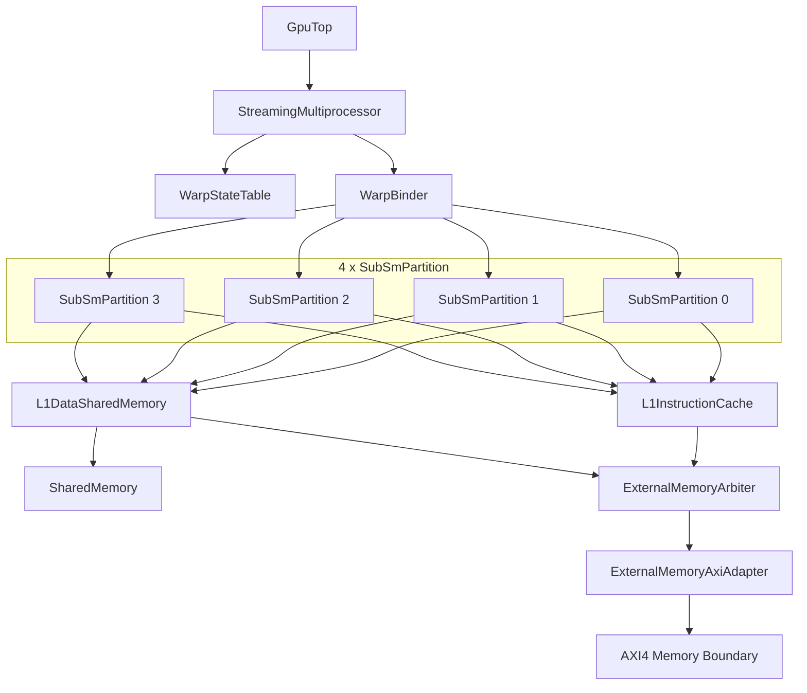
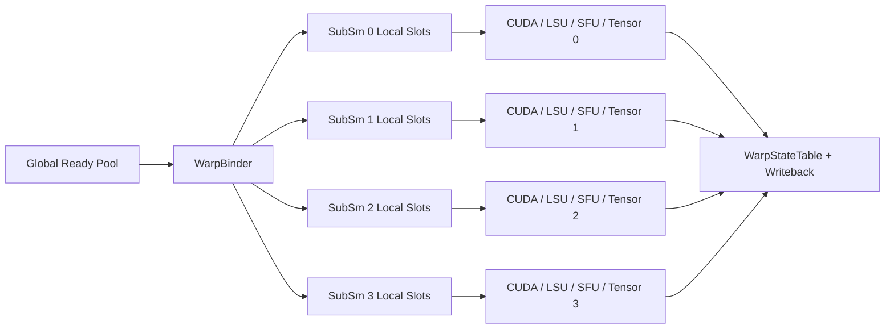
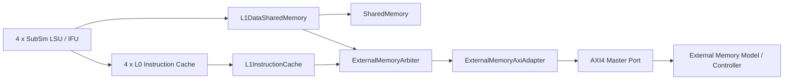
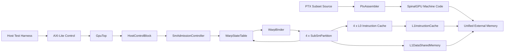

# SM Architecture and Frontend

This repository models one educational SpinalGPU SM with a GH100-style partitioned topology. The software contract remains a PTX subset ISA lowered into a custom 32-bit SpinalGPU machine encoding.

## Summary

- `GpuTop` still exposes one top-level AXI4 memory boundary and one AXI-Lite control boundary.
- One `StreamingMultiprocessor` now contains 4 `SubSmPartition`s instead of one global warp engine.
- Each sub-SM owns its local frontend and execution path:
  - local warp slot scheduler
  - local register-file slice
  - local instruction fetch frontend through an `L0InstructionCache`
  - local CUDA, LSU, SFU, and tensor blocks
- SM-level resources are shared across the 4 partitions:
  - `WarpStateTable`
  - `WarpBinder`
  - `L1InstructionCache`
  - `L1DataSharedMemory`
  - `SharedMemory`
  - `ExternalMemoryArbiter`
  - `ExternalMemoryAxiAdapter`
- SIMT control is still classic and intentionally simple:
  - one PC plus active mask per warp
  - no reconvergence stack
  - one CTA launch at a time
  - non-uniform branch still faults

## Execution Model

- Warps are admitted into one global architectural state table by `SmAdmissionController`.
- Admitted warps begin unbound in a global ready pool.
- `WarpBinder` assigns an unbound runnable warp to a sub-SM and local slot.
- After binding, the warp stays in that partition until exit or fault.
- Each `SubSmPartition` round-robins across its local resident warp slots and can issue one 32-thread warp instruction at a time.
- With the default config, 4 sub-SMs can actively execute 4 different warps concurrently.

## Program Loading Model

- Machine code, global data, and kernel arguments all live in unified external memory.
- The host writes the kernel image and data buffers before launch.
- AXI-Lite MMIO provides launch metadata:
  - `ENTRY_PC`
  - `GRID_DIM_X`
  - `BLOCK_DIM_X`
  - `ARG_BASE`
  - `SHARED_BYTES`
- `SmAdmissionController` validates the launch, clears shared memory, and initializes warp contexts.

## Module Responsibilities

| Module | Responsibility | Current Behavior |
| --- | --- | --- |
| `HostControlBlock` | Exposes command/status CSRs over AXI-Lite | Launch and execution-status control |
| `SmAdmissionController` | Validates launches and initializes architectural warp state | One CTA at a time |
| `WarpStateTable` | Holds architectural warp context for all resident warps | Global runtime state only |
| `WarpBinder` | Binds unbound ready warps into sub-SM local slots | Round-robin across sub-SMs and warps |
| `SubSmPartition` | Local warp scheduling, fetch, decode, issue, and writeback | One warp issue slot per partition |
| `WarpRegisterFile` | Holds per-thread registers for bound local warp slots | One local slice per sub-SM |
| `L0InstructionCache` | Placeholder local instruction-cache stage | Pass-through structural cache level |
| `L1InstructionCache` | Shared instruction-side arbitration point | One outstanding fetch at a time |
| `CudaCoreArray` | Local CUDA arithmetic path inside each partition | Full-warp issue path at the partition boundary |
| `LoadStoreUnit` | Local LSU inside each partition | Shared-memory or global-memory routing |
| `SpecialFunctionUnit` | Local SFU inside each partition | Placeholder vector unary transform |
| `TensorCoreBlock` | Local tensor path inside each partition | Placeholder vector multiply-style response |
| `L1DataSharedMemory` | Shared data/shared-memory fabric across sub-SMs | Arbitrates local LSU traffic |
| `SharedMemory` | SM-local shared memory backing store | Single-port word-addressed memory with clear support |
| `ExternalMemoryArbiter` | Shares the external memory path between instruction and data fabrics | One fetch side plus one LSU side |
| `ExternalMemoryAxiAdapter` | Bridges internal burst req/rsp to AXI4 | Single-outstanding AXI read/write adapter |

## Config Defaults

- Warp size: `32`
- Sub-SM count: `4`
- Resident warps per sub-SM: `2`
- Total resident warps per SM: `8` derived
- Sub-SM issue width: `32`
- Total active CUDA lanes per SM: `128` derived
- LSU count per sub-SM: `1`
- SFU count per sub-SM: `1`
- Tensor block count per sub-SM: `1`
- Shared memory banks: `32`
- Shared memory size: `4 KiB`
- External memory boundary: `AXI4`
- Host control boundary: `AXI-Lite`

## Memory Hierarchy Shape

- Instruction path:
  - `SubSmPartition -> L0InstructionCache -> shared L1InstructionCache -> ExternalMemoryArbiter -> AXI4`
- Data path:
  - `SubSmPartition LSU -> L1DataSharedMemory -> SharedMemory or ExternalMemoryArbiter -> AXI4`
- The L0 and L1 cache blocks are structural placeholders in this milestone. They establish the intended partitioned topology first; detailed caching behavior can come later.

## Interface Rules

- Internal datapaths use typed request/response bundles.
- `Stream` is used where backpressure matters.
- `Flow` is used for debug and observability.
- AXI remains only at the top-level external memory boundary.
- AXI-Lite remains only at the host control boundary.

## ISA Layers

- Public ISA reference: [isa.md](isa.md)
- Internal encoding reference: [machine-encoding.md](machine-encoding.md)
- The current frontend supports:
  - PTX subset source compiled ahead of time
  - fixed 32-bit machine instruction words
  - PTX-visible special registers such as `%tid.x`
  - integer and FP32 CUDA-core ops
  - shared/global load/store plus `.param` lowering
  - uniform branch, exit, and trap

## PTX Corpus Structure

- The teaching corpus is organized by primary feature:
  - `kernels/arithmetic/`
  - `kernels/control/`
  - `kernels/global_memory/`
  - `kernels/shared_memory/`
  - `kernels/special_registers/`
- Success and fault expectations live in typed kernel metadata plus test expectations, not in directory names.

## Diagrams

### High-Level SM Block Diagram

Source: [diagrams/sm-overview.mmd](diagrams/sm-overview.mmd)

### Dispatch And Dataflow Diagram

Source: [diagrams/dispatch-dataflow.mmd](diagrams/dispatch-dataflow.mmd)

### Memory Hierarchy And AXI Boundary Diagram

Source: [diagrams/memory-hierarchy-axi.mmd](diagrams/memory-hierarchy-axi.mmd)

### Launch And Frontend Execution Diagram

Source: [diagrams/frontend-execution.mmd](diagrams/frontend-execution.mmd)

