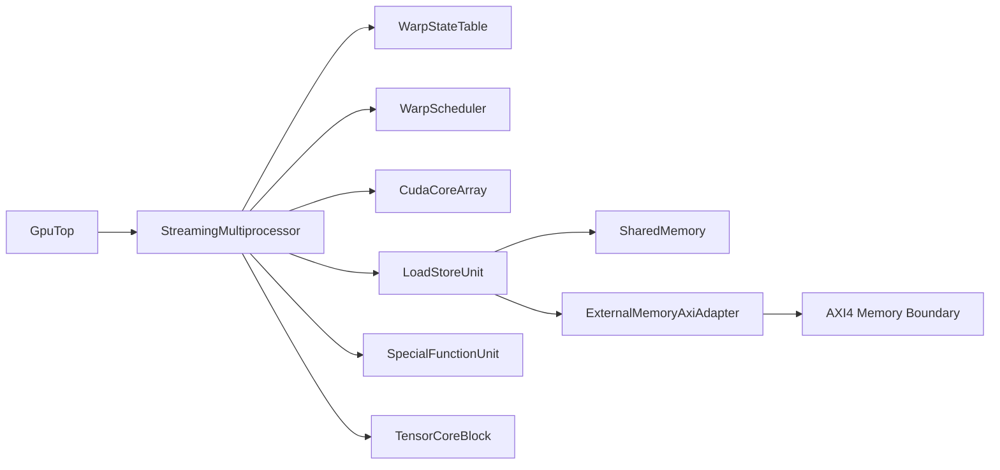
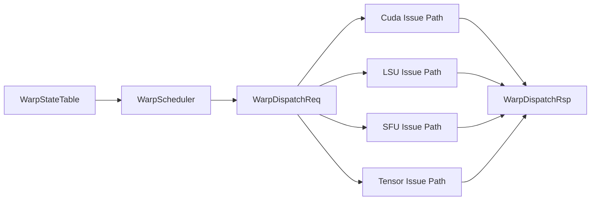
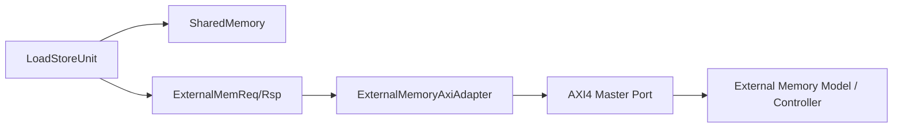
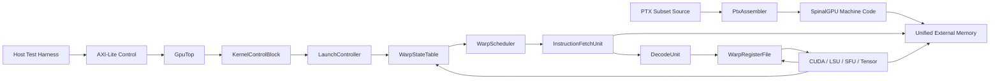

# SM Architecture and Frontend

This repository exposes a single-SM architecture with a real launch, fetch, decode, and writeback frontend. The public software contract is a PTX subset ISA; the hardware executes a custom SpinalGPU machine encoding generated from that PTX subset.

## Summary

- `GpuTop` wraps one `StreamingMultiprocessor`, exposes a top-level AXI4 memory boundary for unified code/data memory, and exposes AXI-Lite MMIO for launch and status control.
- PTX subset source is compiled ahead of time into raw SpinalGPU `.bin` machine code.
- The SM is composed from concrete submodules with stable typed interfaces:
  - `KernelControlBlock`
  - `LaunchController`
  - `WarpStateTable`
  - `WarpScheduler`
  - `InstructionFetchUnit`
  - `DecodeUnit`
  - `WarpRegisterFile`
  - `CudaCoreArray`
  - `LoadStoreUnit`
  - `SharedMemory`
  - `ExternalMemoryArbiter`
  - `ExternalMemoryAxiAdapter`
  - `SpecialFunctionUnit`
  - `TensorCoreBlock`
- Control is classic SIMT in this milestone:
  - one PC + active mask per warp
  - one scheduler
  - first-ready warp selection
  - one global execution engine that fetches, decodes, issues, and writes back one warp instruction at a time

## Program Loading Model

- Compiled machine code, argument buffers, and global data all live in unified external memory.
- The host writes a prebuilt raw kernel binary and any data buffers into external memory before launch.
- AXI-Lite MMIO provides the launch metadata:
  - `ENTRY_PC`
  - `GRID_DIM_X`
  - `BLOCK_DIM_X`
  - `ARG_BASE`
  - `SHARED_BYTES`
- The `LaunchController` turns one block launch into resident warp contexts.
- The warp table stores runtime state only. It does not store PTX source text or a decoded kernel image.
- The scheduler selects a runnable warp, the fetch unit reads the machine instruction at that warp’s `pc`, and the decode/issue path sends the work to the correct unit.

## Module Responsibilities

| Module | Responsibility | Current Step-1 Behavior |
| --- | --- | --- |
| `KernelControlBlock` | Exposes launch/status CSRs over AXI-Lite | Launch registers and status reads |
| `LaunchController` | Validates launches, clears shared memory, initializes warp contexts | One-block v1 launch only |
| `WarpStateTable` | Holds resident warp runtime context | Runtime-only context, no program storage |
| `WarpScheduler` | Chooses the next runnable warp | Picks the lowest-index runnable warp |
| `InstructionFetchUnit` | Reads 32-bit instructions from external memory | Aligned word fetch only |
| `DecodeUnit` | Classifies machine instruction words and extracts operands/immediates | SpinalGPU machine-code decode for the PTX subset ISA |
| `WarpRegisterFile` | Holds per-thread registers for resident warps | 32 registers per thread, `r0 = 0` |
| `CudaCoreArray` | Handles integer arithmetic issue class | Full-warp semantic execution |
| `LoadStoreUnit` | Routes warp memory ops to shared or external memory | Per-lane serialized memory access |
| `SharedMemory` | SM-local memory block | Single-port word-addressed memory with clear support |
| `ExternalMemoryArbiter` | Shares one external memory path between fetch and LSU | Round-robin between fetch and LSU |
| `ExternalMemoryAxiAdapter` | Bridges internal memory req/rsp to AXI4 | Single-outstanding AXI read/write adapter |
| `SpecialFunctionUnit` | Handles special-function issue class | Placeholder vector unary transform |
| `TensorCoreBlock` | Handles tensor issue class | Placeholder vector multiply-style response |

## Config Defaults

- Warp size: `32`
- Warp schedulers: `1`
- CUDA arithmetic lanes: `8`
- LSU count: `1`
- SFU count: `1`
- Tensor block count: `1`
- Shared memory banks: `32`
- Resident warps: `4`
- External memory boundary: `AXI4`
- Host control boundary: `AXI-Lite`

## Interface Rules

- Internal block contracts are typed request/response bundles.
- `Stream` is used when backpressure matters.
- `Flow` is used for debug observability.
- Kernel launch/status CSRs live behind an AXI-Lite control block at the top level.
- Unified external memory holds machine code, arguments, and global data.
- Fetch and LSU share one external memory path through an internal arbiter.
- AXI stays at the top-level memory boundary, not inside every SM block.

## ISA Layers

- Public ISA reference: [isa.md](isa.md)
- Internal encoding reference: [machine-encoding.md](machine-encoding.md)
- The current frontend supports:
  - PTX subset source compiled ahead of time
  - fixed 32-bit machine instruction words
  - PTX-visible special registers such as `%tid.x`
  - integer ALU ops
  - shared/global load/store plus `.param` lowering
  - uniform branch, exit, and trap

## PTX Corpus Structure

- The teaching corpus is organized by primary feature rather than by pass/fault status:
  - `kernels/arithmetic/`
  - `kernels/control/`
  - `kernels/global_memory/`
  - `kernels/shared_memory/`
  - `kernels/special_registers/`
- Outcome remains a manifest concern. Success and fault expectations live in typed kernel metadata plus test expectations, not in directory names.
- "Layers" or "modules" in the kernel corpus mean repository structure and file sections only. The PTX subset still does not support includes, imports, macros, or multi-entry source files.

## PTX Teaching Template

- Each PTX source follows the same readable template:
  - `// Purpose:`
  - `// Primary feature:`
  - `// Expected outcome:`
  - `.version`, `.target`, `.address_size`
  - one `.visible .entry` signature
  - declarations ordered as `.reg`, then `.pred`, then `.shared`
  - `// Setup`
  - `// Core`
  - `// Exit` or `// Fault trigger`

## Diagrams

### High-Level SM Block Diagram

Source: [diagrams/sm-overview.mmd](diagrams/sm-overview.mmd)

### Dispatch And Dataflow Diagram

Source: [diagrams/dispatch-dataflow.mmd](diagrams/dispatch-dataflow.mmd)

### Memory Hierarchy And AXI Boundary Diagram

Source: [diagrams/memory-hierarchy-axi.mmd](diagrams/memory-hierarchy-axi.mmd)

### Launch And Frontend Execution Diagram

Source: [diagrams/frontend-execution.mmd](diagrams/frontend-execution.mmd)

