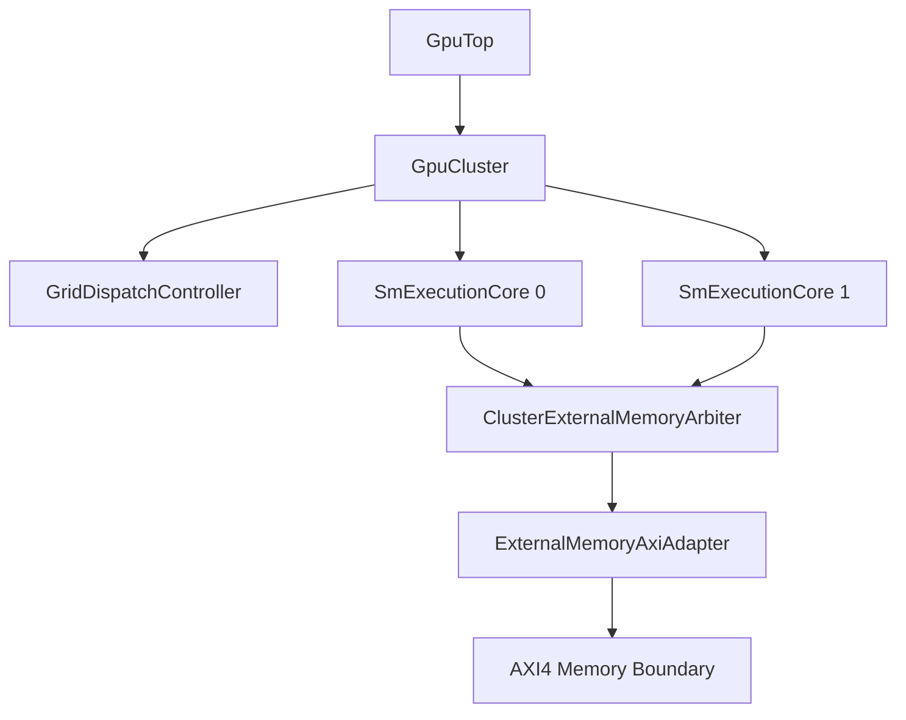
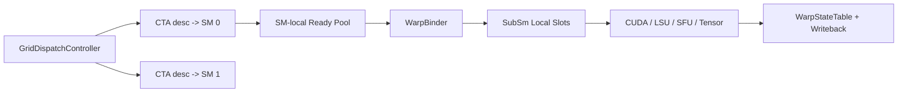
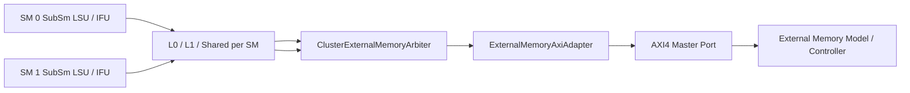
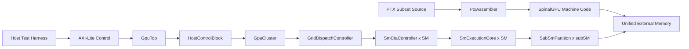

# SM Architecture and Frontend

This repository now models a chip-level SpinalGPU cluster with one or more physical SM execution cores. The software contract remains a PTX subset ISA lowered into a custom 32-bit SpinalGPU machine encoding.

## Summary

- `GpuTop` still exposes one top-level AXI4 memory boundary and one AXI-Lite control boundary.
- `GpuTop` now instantiates a `GpuCluster`, not a bare SM.
- Compile-time config is now split by scope:
  - `GpuConfig` owns chip-level config such as cluster sizing and host-control boundary widths.
  - `SmConfig` owns SM-local execution, cache, register-file, and shared-memory parameters.
- `GpuCluster` owns chip-level orchestration:
  - one `GridDispatchController`
  - one `SmCtaController` per physical SM
  - one `SmExecutionCore` per physical SM
  - one `ClusterExternalMemoryArbiter`
  - one shared `ExternalMemoryAxiAdapter`
- `StreamingMultiprocessor` remains as the single-SM compatibility wrapper used by existing one-SM tests and harnesses.
- Each physical SM still contains 4 `SubSmPartition`s by default.
- Each sub-SM owns its local frontend and execution path:
  - local warp slot scheduler
  - local register-file slice
  - local instruction fetch frontend through an `L0InstructionCache`
  - local CUDA, LSU, SFU, and tensor blocks
  - local `PendingWarpOp` tracking plus typed `SubSmStatus`
- SM-local resources are shared across the 4 partitions:
  - `WarpStateTable`
  - `WarpBinder`
  - `L1InstructionCache`
  - `L1DataSharedMemory`
  - `SharedMemory`
  - `ExternalMemoryArbiter`
- Cluster-level resources are shared across all physical SMs:
  - `GridDispatchController`
  - `ClusterExternalMemoryArbiter`
  - one top-level `ExternalMemoryAxiAdapter`
- SIMT control is still classic and intentionally simple:
  - one PC plus active mask per warp
  - no reconvergence stack
  - one kernel globally in flight
  - one resident CTA per physical SM in this phase
  - non-uniform branch still faults

## Execution Model

- `GridDispatchController` validates one kernel launch, latches one launch-global `gridId`, and walks the CTA grid in `x -> y -> z` order.
- CTAs are dispatched round-robin onto idle physical SMs.
- Each physical SM accepts at most one resident CTA in this phase.
- Within one physical SM, `SmCtaController` clears shared memory, initializes warp contexts, and tracks CTA completion/fault state.
- Warps are admitted into one SM-local architectural state table by `SmCtaController` or `SmAdmissionController`, depending on whether the chip is running through `GpuCluster` or the single-SM wrapper.
- Admitted warps begin unbound in an SM-local ready pool.
- `WarpBinder` assigns an unbound runnable warp to a sub-SM and local slot.
- After binding, the warp stays in that partition until exit or fault.
- Each `SubSmPartition` round-robins across its local resident warp slots and can issue one 32-thread warp instruction at a time.
- With the default config, one physical SM contains 4 sub-SMs and can actively execute 4 different warps concurrently inside the resident CTA.

## Program Loading Model

- Machine code, global data, and kernel arguments all live in unified external memory.
- The host writes the kernel image and data buffers before launch.
- AXI-Lite MMIO provides launch metadata:
  - `ENTRY_PC`
  - `GRID_DIM_{X,Y,Z}`
  - `BLOCK_DIM_{X,Y,Z}`
  - `ARG_BASE`
  - `SHARED_BYTES`
- In the cluster path, `GridDispatchController` validates the full 3D launch once and dispatches CTA descriptors to SMs.
- In the single-SM compatibility path, `SmAdmissionController` still validates the narrow one-CTA launch model for legacy tests.

## Module Responsibilities

| Module | Responsibility | Current Behavior |
| --- | --- | --- |
| `HostControlBlock` | Exposes command/status CSRs over AXI-Lite | Launch and execution-status control |
| `GpuCluster` | Chip-level multi-SM container | One kernel globally in flight, one shared AXI boundary |
| `GridDispatchController` | Validates launch, walks 3D CTA coordinates, and dispatches CTAs to idle SMs | Full 3D grid, one resident CTA per SM, first-fault stops further dispatch |
| `SmCtaController` | Owns one CTA lifecycle on one physical SM | Clears shared memory, initializes warps, and reports CTA completion/fault |
| `SmExecutionCore` | SM-local execution body without a direct AXI boundary | Warp state, sub-SMs, local caches, shared memory, and local fetch/LSU routing |
| `StreamingMultiprocessor` | Single-SM compatibility wrapper | Preserves the legacy AXI-backed harness shape for default one-SM tests |
| `SmAdmissionController` | Validates launches and initializes architectural warp state in the compatibility wrapper | One CTA only, `gridDim=(1,1,1)` only |
| `WarpStateTable` | Holds architectural warp context for all resident warps inside one SM | SM-local runtime state only |
| `WarpBinder` | Binds unbound ready warps into sub-SM local slots | Round-robin across sub-SMs and warps |
| `SubSmPartition` | Local warp scheduling, fetch, decode, issue, and writeback | One warp issue slot per partition with typed status and latched pending-op completion |
| `LocalWarpSlotTable` | Tracks local slot occupancy and bound warp IDs | Handles free-slot lookup and clear/rebind state |
| `LocalWarpScheduler` | Chooses the next ready local slot | Round-robin from a rotating local base |
| `WarpRegisterFile` | Holds per-thread registers for bound local warp slots | One local slice per sub-SM |
| `SpecialRegisterReadUnit` | Synthesizes `%tid`, `%ntid`, `%ctaid`, `%smid`, `%gridid`, and similar reads | Dedicated special-register datapath inside each partition |
| `L0InstructionCache` | Placeholder local instruction-cache stage | Pass-through structural cache level |
| `L1InstructionCache` | Shared instruction-side arbitration point | One outstanding fetch at a time |
| `CudaCoreArray` | Local CUDA arithmetic path inside each partition | Scalar FP32, scalar/packed FP16, packed FP8 conversion, integer ALU, and compare/select issue path |
| `LoadStoreUnit` | Local LSU inside each partition | Shared-memory routing plus 16-bit and 32-bit global-memory traffic |
| `SpecialFunctionUnit` | Local SFU inside each partition | Placeholder vector unary transform |
| `TensorCoreBlock` | Local tensor path inside each partition | Warp-synchronous `ldmatrix` / `mma.sync` / `stmatrix` v1 with serialized RF/shared-memory sequencing |
| `L1DataSharedMemory` | Shared data/shared-memory fabric across sub-SMs | Arbitrates local LSU traffic |
| `SharedMemory` | SM-local shared memory backing store | Single-port word-addressed memory with clear support; the public PTX surface is still 32-bit only here |
| `ExternalMemoryArbiter` | Shares the external memory path between instruction and data fabrics | One fetch side plus one LSU side |
| `ClusterExternalMemoryArbiter` | Shares the external memory path across physical SMs | One outstanding SM burst at a time in the current phase |
| `ExternalMemoryAxiAdapter` | Bridges internal burst req/rsp to AXI4 | Single shared AXI adapter at the cluster boundary |

## Config Defaults

- `GpuConfig.default` is the top-level chip contract.
- `GpuConfig.cluster.smCount = 1` by default.
- `GpuConfig.host.controlAddressWidth = 8` by default.
- `GpuConfig.sm = SmConfig.default` by default.
- Physical SM count: `1`
- Warp size: `32`
- Sub-SM count: `4`
- Resident warps per sub-SM: `2`
- Total resident warps per SM: `8` derived
- Sub-SM issue width: `32`
- Total active CUDA lanes per SM: `128` derived
- LSU count per sub-SM: `1`
- SFU count per sub-SM: `1`
- Tensor block count per sub-SM: `1`
- Shared memory banks: `32`
- Shared memory size: `4 KiB`
- External memory boundary: `AXI4`
- Host control boundary: `AXI-Lite`

## Memory Hierarchy Shape

- Inside one physical SM:
  - instruction path:
    - `SubSmPartition -> L0InstructionCache -> shared L1InstructionCache -> ExternalMemoryArbiter -> SM external burst port`
  - data path:
    - `SubSmPartition LSU -> L1DataSharedMemory -> SharedMemory or ExternalMemoryArbiter -> SM external burst port`
- At the chip boundary:
  - `SmExecutionCore burst ports -> ClusterExternalMemoryArbiter -> ExternalMemoryAxiAdapter -> AXI4`
- Shared memory is SM-local. There is no cross-SM shared-memory fabric in this phase.
- The L0 and L1 cache blocks are still structural placeholders. They establish the intended partitioned topology first; detailed caching behavior can come later.

## Interface Rules

- Internal datapaths use typed request/response bundles.
- `Stream` is used where backpressure matters.
- `Flow` is used for debug and observability.
- AXI remains only at the top-level external memory boundary.
- AXI-Lite remains only at the host control boundary.

## ISA Layers

- Public ISA reference: [isa.md](isa.md)
- Internal encoding reference: [machine-encoding.md](machine-encoding.md)
- The current frontend supports:
  - PTX subset source compiled ahead of time
  - fixed 32-bit machine instruction words
  - PTX-visible special registers such as `%tid.x`, `%ctaid.x`, and `%smid`
  - integer, FP32, FP16, packed FP16x2, and packed FP8 conversion CUDA-core ops
  - 16-bit and 32-bit global load/store plus `.param` lowering
  - 32-bit shared-memory load/store
  - uniform branch, exit, and trap

## PTX Corpus Structure

- The teaching corpus is organized by primary feature:
  - `kernels/arithmetic/`
  - `kernels/control/`
  - `kernels/global_memory/`
  - `kernels/shared_memory/`
  - `kernels/special_registers/`
- Success and fault expectations live in typed kernel metadata plus test expectations, not in directory names.

## Diagrams

### High-Level Cluster Diagram

Source: [diagrams/sm-overview.mmd](diagrams/sm-overview.mmd)

### Dispatch And Dataflow Diagram

Source: [diagrams/dispatch-dataflow.mmd](diagrams/dispatch-dataflow.mmd)

### Memory Hierarchy And AXI Boundary Diagram

Source: [diagrams/memory-hierarchy-axi.mmd](diagrams/memory-hierarchy-axi.mmd)

### Launch And Frontend Execution Diagram

Source: [diagrams/frontend-execution.mmd](diagrams/frontend-execution.mmd)

