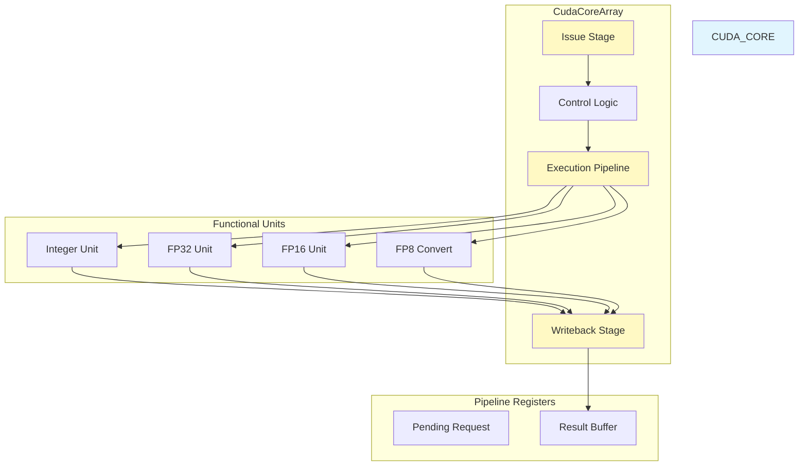
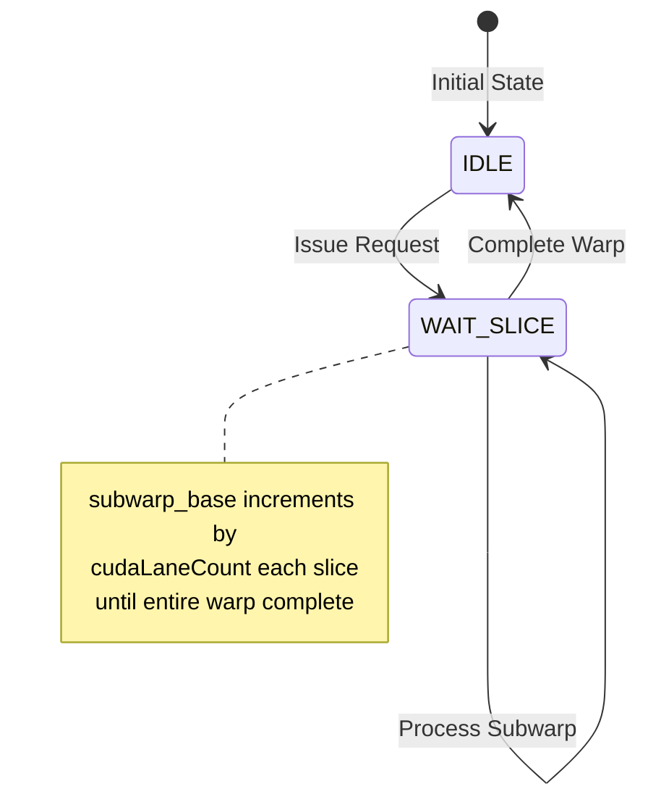
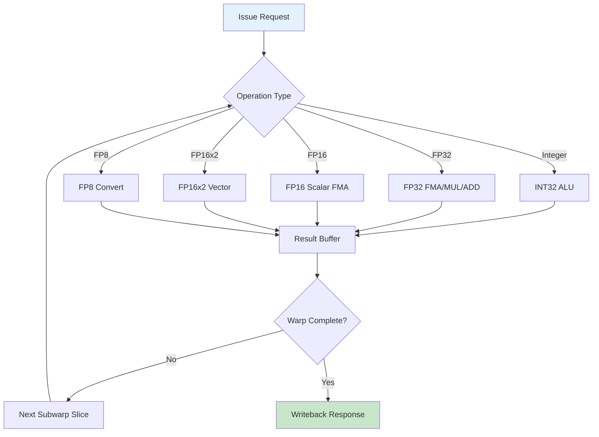
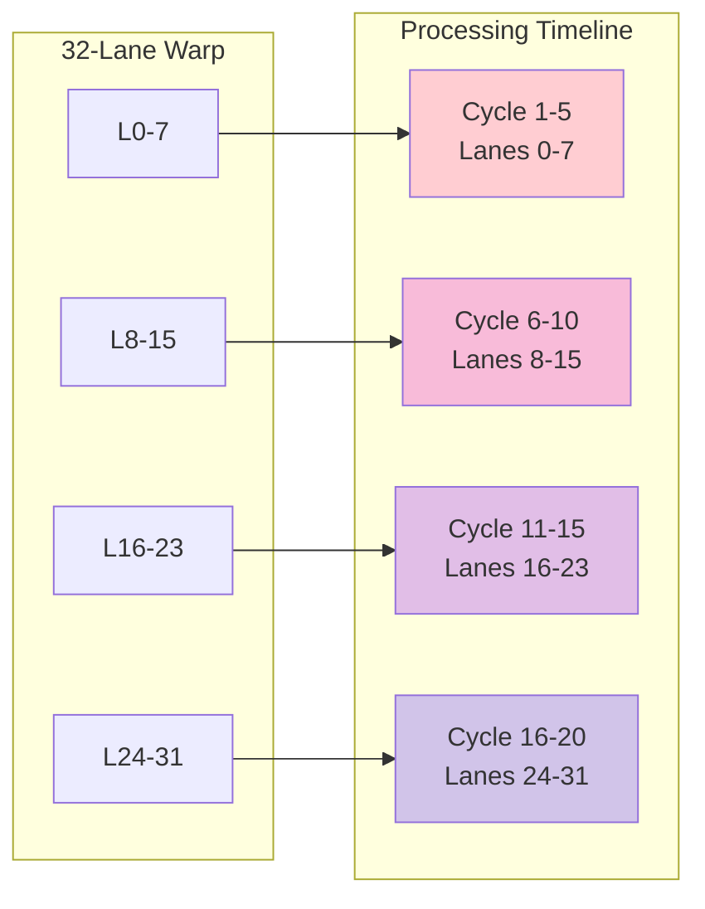
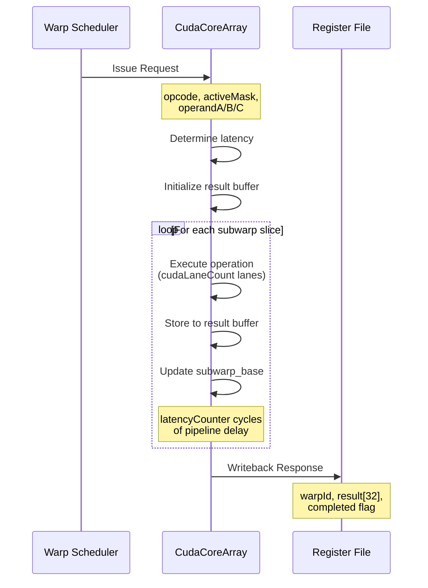
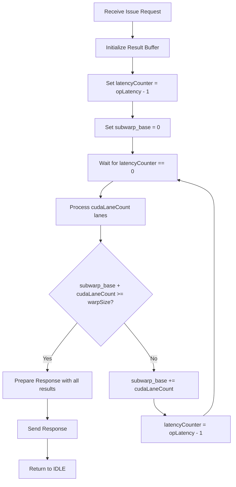
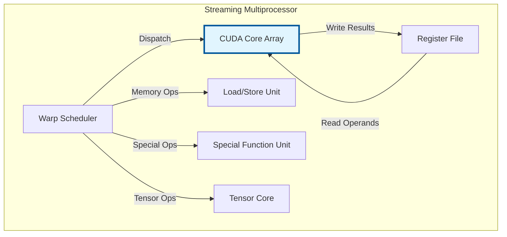

# CUDA Core Subsystem

## Abstract

The CUDA Core subsystem is the primary computational engine of the SpinalGPU Streaming Multiprocessor (SM), responsible for executing scalar and vector arithmetic operations on 32-thread warps. It implements a pipelined SIMD execution unit supporting integer (INT32), floating-point (FP32, FP16), and tensor operations with configurable latencies. The core processes instructions in a time-multiplexed fashion across multiple lanes, providing the fundamental computational throughput for parallel workloads.

## Background

### What are CUDA Cores?

In NVIDIA GPU architecture, CUDA Cores are the fundamental scalar processing units that execute arithmetic operations on individual threads. Unlike vector units that process wide vectors atomically, CUDA Cores implement SIMT (Single Instruction, Multiple Threads) execution where the same operation is applied across all lanes of a warp (32 threads), but each lane maintains its own operand values and produces independent results.

### Problem Statement

GPUs must achieve high throughput for parallel computations while maintaining:

1. **Scalar Semantics**: Each thread executes independently with its own register state
2. **Warp-Level Synchronization**: All 32 threads execute instructions in lockstep
3. **Mixed Precision**: Support for INT32, FP32, FP16, and FP8 data types
4. **Pipelined Execution**: Multiple instructions in flight to maximize throughput
5. **Configurable Performance**: Trade-offs between area, latency, and throughput

The CUDA Core subsystem solves this by implementing a time-multiplexed execution pipeline that processes warp instructions in subwarp slices, with configurable latencies for different operation types and dedicated hardware for each precision domain.

### Relationship to NVIDIA Architecture

This implementation closely mirrors NVIDIA's CUDA Core design:

- **SIMT Execution**: 32 threads per warp executing in lockstep
- **Scalar Operations**: Each lane performs independent arithmetic
- **Precision Support**: FP32 (single precision), FP16 (half precision), FP8, and INT32
- **FMA Operations**: Fused multiply-add for both FP32 and FP16
- **Subwarp Slicing**: Processing warps in smaller groups to reduce area

## Architecture

### High-Level Organization



### Execution Pipeline Stages



### Data Flow



### Subwarp Slicing

To reduce hardware area while maintaining throughput, the CUDA Core processes warps in smaller "subwarp" slices:



## Components and Features

### Integer Operations (INT32)

The integer unit provides standard 32-bit arithmetic and logical operations:

| Operation | Opcode | Latency | Description |
|-----------|--------|---------|-------------|
| ADD | 0x10 | 1 cycle | Integer addition |
| ADDI | 0x11 | 1 cycle | Addition with immediate |
| SUB | 0x12 | 1 cycle | Integer subtraction |
| MULLO | 0x13 | 1 cycle | Low 32 bits of multiplication |
| AND | 0x14 | 1 cycle | Bitwise AND |
| OR | 0x15 | 1 cycle | Bitwise OR |
| XOR | 0x16 | 1 cycle | Bitwise XOR |
| SHL | 0x17 | 1 cycle | Logical left shift |
| SHR | 0x18 | 1 cycle | Logical right shift |
| SETEQ | 0x19 | 1 cycle | Set if equal |
| SETLT | 0x1A | 1 cycle | Set if less than (unsigned) |
| SETLTS | 0x1E | 1 cycle | Set if less than (signed) |

**Implementation Details**:
- All integer operations complete in 1 cycle (default `cudaIntegerLatency`)
- Multiplication returns the low 32 bits (high bits discarded)
- Shifts use the lower 5 bits of the shift amount
- Comparison operations return 0 or 1, extended to 32 bits

### Floating-Point Operations (FP32)

FP32 operations follow IEEE 754 single-precision format:

| Operation | Opcode | Latency | Description |
|-----------|--------|---------|-------------|
| FADD | 0x1B | 4 cycles | Floating-point addition |
| FSUB | 0x1F | 4 cycles | Floating-point subtraction |
| FMUL | 0x1C | 4 cycles | Floating-point multiplication |
| FFMA | 0x1D | 5 cycles | Fused multiply-add (a*b+c) |
| FABS | 0x25 | 4 cycles | Absolute value |
| FNEG | 0x26 | 4 cycles | Negation |
| FSETEQ | 0x27 | 4 cycles | FP equality test |
| FSETLT | 0x28 | 4 cycles | FP less-than test |

**FP32 Math Implementation** (from `Fp32Math.scala`):

- **Format**: 1 sign bit, 8 exponent bits (bias 127), 23 fraction bits
- **Denormals**: Supported with gradual underflow
- **NaN Handling**: Canonical NaN (0x7FC00000) for invalid operations
- **Rounding**: Round-to-nearest-even (IEEE 754 default)
- **FMA Operation**: Single rounding for a×b+c (higher precision than separate mul+add)

### Half-Precision Operations (FP16)

FP16 operations support IEEE 754 half-precision format:

| Operation | Opcode | Latency | Description |
|-----------|--------|---------|-------------|
| HADD | 0x2B | 4 cycles | FP16 addition (scalar) |
| HMUL | 0x2C | 4 cycles | FP16 multiplication (scalar) |
| HFMA | 0x2D | 4 cycles | FP16 FMA (scalar) |
| HADD2 | 0x2E | 4 cycles | Dual FP16 addition (packed) |
| HMUL2 | 0x2F | 4 cycles | Dual FP16 multiplication (packed) |
| CVTF32F16 | 0x35 | 4 cycles | Convert FP32 to FP16 |
| CVTF16F32 | 0x36 | 4 cycles | Convert FP16 to FP32 |

**FP16 Math Implementation** (from `Fp16Math.scala`):

- **Format**: 1 sign bit, 5 exponent bits (bias 15), 10 fraction bits
- **Scalar Operations**: Operate on 16-bit values in low half of 32-bit register
- **Packed Operations**: Process two independent FP16 values per lane
- **Conversion**: Precision-preserving with round-to-nearest-even
- **Denormals**: Supported for both source and destination

**Packed FP16 (2x16) Layout**:

```
Register [31:0]
  |<----- FP16 #1 ----->|<----- FP16 #0 ----->|
  |  Sign  | Exp  | Frac |  Sign  | Exp  | Frac |
  |<1 bit>|<5 bits>|<10 bits>|<1 bit>|<5 bits>|<10 bits>|
```

### FP8 Conversion Operations

FP8 support provides conversion between FP8 and FP16 formats for AI/ML workloads:

| Operation | Opcode | Latency | Description |
|-----------|--------|---------|-------------|
| CVTF16X2E4M3X2 | 0x37 | 4 cycles | Convert 2xFP16 to 2xFP8 (E4M3) |
| CVTF16X2E5M2X2 | 0x38 | 4 cycles | Convert 2xFP16 to 2xFP8 (E5M2) |
| CVTE4M3X2F16X2 | 0x39 | 4 cycles | Convert 2xFP8 (E4M3) to 2xFP16 |
| CVTE5M2X2F16X2 | 0x3A | 4 cycles | Convert 2xFP8 (E5M2) to 2xFP16 |

**FP8 Formats** (from `Fp8Format.scala`):

- **E4M3**: 1 sign, 4 exponent, 3 fraction (bias 7) - higher precision range
- **E5M2**: 1 sign, 5 exponent, 2 fraction (bias 15) - wider dynamic range
- **Saturation**: Saturates to finite values (no infinities/NaN in destination)
- **Rounding**: Round-to-nearest-even with tie-breaking

### Special Operations

| Operation | Opcode | Latency | Description |
|-----------|--------|---------|-------------|
| MOV | 0x01 | 1 cycle | Register-to-register move |
| MOVI | 0x02 | 1 cycle | Move immediate |
| SEL | 0x24 | 1 cycle | Select based on third operand |

**SEL Operation**: Returns `operandC != 0 ? operandA : operandB`, implementing a ternary operator.

## Implementation and Usage

### Instruction Execution Flow



### Operation Latency Mapping

The `opLatency` function maps each opcode to its pipeline latency:

```scala
private def opLatency(opcode: Bits): UInt = {
  latency := config.cudaIntegerLatency  // Default: 1 cycle
  switch(opcode) {
    is(B(Opcode.FADD, 8 bits)) { latency := config.fpAddLatency }       // 4 cycles
    is(B(Opcode.FMUL, 8 bits)) { latency := config.fpMulLatency }       // 4 cycles
    is(B(Opcode.FFMA, 8 bits)) { latency := config.fpFmaLatency }       // 5 cycles
    is(B(Opcode.HADD, 8 bits)) { latency := config.fp16ScalarLatency }  // 4 cycles
    is(B(Opcode.HADD2, 8 bits)) { latency := config.fp16x2Latency }    // 4 cycles
    is(B(Opcode.CVTF16X2E4M3X2, 8 bits)) { latency := config.fp8ConvertLatency } // 4 cycles
    // ... other operations
  }
  latency
}
```

### Result Computation

The `opResult` function computes the result for a single lane:

```scala
private def opResult(opcode: Bits, operandA: Bits, operandB: Bits, operandC: Bits): Bits = {
  val result = UInt(config.dataWidth bits)
  result := operandA.asUInt  // Default: MOV behavior

  switch(opcode) {
    is(B(Opcode.ADD, 8 bits)) {
      result := operandA.asUInt + operandB.asUInt
    }
    is(B(Opcode.FFMA, 8 bits)) {
      result := Fp32Math.fma(operandA, operandB, operandC).asUInt
    }
    is(B(Opcode.HADD2, 8 bits)) {
      result := Fp16Math.add2(operandA, operandB).asUInt
    }
    // ... other operations
  }
  result.asBits
}
```

### Subwarp Processing Loop



### State Machine

The core uses a simple 2-state machine:

```scala
private object State extends SpinalEnum {
  val IDLE, WAIT_SLICE = newElement()
}

// State transitions:
// IDLE -> WAIT_SLICE: On issue.fire (accept new request)
// WAIT_SLICE -> WAIT_SLICE: Processing subwarp slices
// WAIT_SLICE -> IDLE: Final slice complete, response sent
```

## Examples

### Example 1: Integer Addition

**Instruction**: `add r5, r2, r3`

**Execution**:
```
Input:
  warpId = 0
  activeMask = 0xFFFFFFFF (all lanes active)
  operandA[0..31] = [1, 2, 3, ..., 32]
  operandB[0..31] = [10, 20, 30, ..., 320]

Operation (per lane):
  result[i] = operandA[i] + operandB[i]

Output:
  result[0..31] = [11, 22, 33, ..., 352]

Latency: 1 cycle × (32 lanes / 32 cudaLaneCount) = 1 cycle
```

### Example 2: FP32 FMA Operation

**Instruction**: `ffma r8, r4, r5, r6`

**Execution**:
```
Input:
  warpId = 1
  activeMask = 0x0000FFFF (lanes 0-15 active)
  operandA = 1.5 (0x3FC00000)
  operandB = 2.0 (0x40000000)
  operandC = 0.5 (0x3F000000)

Operation:
  result = 1.5 × 2.0 + 0.5 = 3.0 + 0.5 = 3.5

Output:
  result[0..15] = 3.5 (0x40600000)
  result[16..31] = 0 (inactive lanes)

Latency: 5 cycles (fpFmaLatency)
Subwarp slices: 1 (assuming cudaLaneCount=32)
Total time: 5 cycles
```

### Example 3: Packed FP16 Addition

**Instruction**: `hadd2 r10, r7, r8`

**Execution**:
```
Input:
  warpId = 2
  activeMask = 0xFFFFFFFF
  operandA[0] = 0x40004000 (two FP16: 2.0, 0.5)
  operandB[0] = 0x40404040 (two FP16: 2.5, 2.5)

Operation:
  result[0].low = 2.0 + 2.5 = 4.5 (0x4680)
  result[0].high = 0.5 + 2.5 = 3.0 (0x4200)

Output:
  result[0] = 0x46804200

Latency: 4 cycles (fp16x2Latency)
Throughput: 64 FP16 operations per cycle (32 lanes × 2 per lane)
```

### Example 4: Subwarp-Sliced Execution

**Configuration**: `cudaLaneCount = 8`, `warpSize = 32`

**Instruction**: `fmul r12, r9, r10`

**Execution Timeline**:

```
Cycle 0:  Issue request received
Cycle 1-4: Process lanes 0-7
  result[0..7] = operandA[0..7] * operandB[0..7]
Cycle 5-8: Process lanes 8-15
  result[8..15] = operandA[8..15] * operandB[8..15]
Cycle 9-12: Process lanes 16-23
  result[16..23] = operandA[16..23] * operandB[16..23]
Cycle 13-16: Process lanes 24-31
  result[24..31] = operandA[24..31] * operandB[24..31]
Cycle 17: Response sent with all 32 results

Total latency: 4 cycles/slice × 4 slices = 16 cycles
```

### Example 5: FP8 Conversion

**Instruction**: `cvte4m3x2f16x2 r15, r14`

**Execution**:
```
Input:
  warpId = 0
  activeMask = 0xFFFFFFFF
  operandA[0] = 0x3C003800 (FP16: 1.0, 0.75)

Operation:
  result[0].low = FP16(1.0) → FP8_E4M3(0x3E)
  result[0].high = FP16(0.75) → FP8_E4M3(0x34)

Output:
  result[0] = 0x3E34 (packed FP8 values)

Conversion details:
  1.0 (FP16: 0x3C00) = 1.0 × 2^0
     → E4M3: exp=7+0=7 (0111), frac=0
     → 0x3E (0011 1110)

  0.75 (FP16: 0x3800) = 1.5 × 2^-1
     → E4M3: exp=7-1=6 (0110), frac=0.5 (100)
     → 0x34 (0011 0100)
```

## Design Considerations

### Performance vs. Area Trade-offs

**Subwarp Slicing** (`cudaLaneCount` parameter):

| cudaLaneCount | Area | Latency | Throughput | Use Case |
|---------------|------|---------|------------|----------|
| 32 | High | 1× | High | High-performance GPUs |
| 16 | Medium | 2× | Medium | Balanced designs |
| 8 | Low | 4× | Low | Area-constrained designs |
| 4 | Very Low | 8× | Very Low | Minimal implementations |

**Example Calculation**:
- For `fpFmaLatency = 5`, `cudaLaneCount = 8`, `warpSize = 32`
- Per-instruction latency: 5 cycles × 4 slices = 20 cycles
- Throughput: 1 warp completion per 20 cycles

### Precision Handling

**FP32 Precision**:
- IEEE 754 compliant
- Gradual underflow with denormals
- Correct rounding for all operations
- NaN propagation and canonical NaN generation

**FP16 Precision**:
- IEEE 754 half-precision
- Subnormal support in conversion
- Round-to-nearest-even
- Separate scalar and packed instruction variants

**FP8 Precision**:
- Two formats: E4M3 (4-bit exponent) and E5M2 (5-bit exponent)
- Saturation arithmetic (no infinities/NaN in results)
- Optimized for AI/ML matrix operations
- Lower precision but higher throughput for inference

### Throughput Characteristics

**Theoretical Peak Throughput** (per CUDA Core, per cycle):

| Operation | Precision | Operations/Cycle |
|-----------|-----------|------------------|
| INT32 ADD | INT32 | 32 |
| FP32 FMA | FP32 | 32 |
| FP16 FMA | FP16 | 32 |
| FP16x2 MUL | FP16 | 64 |
| FP8 Convert | FP8 | 64 |

**Effective Throughput** (accounting for latencies and slicing):

```
Throughput = (warpSize / (opLatency × (warpSize / cudaLaneCount)))

For FP32 FMA with cudaLaneCount=8:
  Throughput = 32 / (5 × 4) = 1.6 warps/cycle

For FP32 FMA with cudaLaneCount=32:
  Throughput = 32 / (5 × 1) = 6.4 warps/cycle
```

### Latency Configuration

The `SmConfig` parameter allows tuning latencies for different precision domains:

```scala
case class SmConfig(
  cudaIntegerLatency: Int = 1,      // INT operations
  fpAddLatency: Int = 4,            // FP32 add/sub
  fpMulLatency: Int = 4,            // FP32 multiply
  fpFmaLatency: Int = 5,            // FP32 fused multiply-add
  fp16ScalarLatency: Int = 4,       // FP16 scalar operations
  fp16x2Latency: Int = 4,           // FP16 packed operations
  fp8ConvertLatency: Int = 4        // FP8 conversions
)
```

**Trade-offs**:
- **Lower Latency**: Higher clock frequency, but larger area and power
- **Higher Latency**: Smaller area, but reduced throughput
- **Balanced Design**: Match latencies to operation complexity (FMA > MUL > ADD)

### Pipeline Hazards

The current implementation is **non-pipelined**:
- Only one warp instruction can be in flight at a time
- Next instruction must wait for previous to complete
- Simplifies control logic at cost of throughput

**Future Enhancements**:
- Pipeline registers for overlapping execution
- Out-of-order completion support
- Multi-issue capability for independent operations

### Active Mask Handling

The `activeMask` parameter controls which lanes participate:
- Inactive lanes skip computation but maintain their position
- Results for inactive lanes are zeroed in output
- Supports predicated execution and thread divergence

**Example**:
```
activeMask = 0x00000FFF (lanes 0-11 active)
operandA = [a0, a1, ..., a31]
operandB = [b0, b1, ..., b31]

result[0..11] = operandA[0..11] + operandB[0..11]  // Computed
result[12..31] = 0                                  // Inactive
```

## Integration with GPU Architecture

### Relationship to Other SM Components



### Instruction Dispatch Flow

1. **Fetch Stage**: Instruction fetched from I-cache
2. **Decode Stage**: Opcode decoded, operands identified
3. **Dispatch Stage**: Routed to appropriate execution unit:
   - CUDA Core: Arithmetic and logical operations
   - LSU: Load/store operations
   - SFU: Special functions (e.g., NOT)
   - Tensor Core: Matrix operations
4. **Execute Stage**: Operation performed in CUDA Core
5. **Writeback Stage**: Results written to register file

### Configuration Parameters

The CUDA Core is configured through `SmConfig`:

| Parameter | Default | Description |
|-----------|---------|-------------|
| `warpSize` | 32 | Threads per warp |
| `subSmCount` | 4 | Number of sub-SM partitions |
| `cudaLaneCount` | 32 | Lanes processed per slice |
| `cudaIntegerLatency` | 1 | INT operation latency |
| `fpAddLatency` | 4 | FP32 add latency |
| `fpMulLatency` | 4 | FP32 mul latency |
| `fpFmaLatency` | 5 | FP32 FMA latency |
| `fp16ScalarLatency` | 4 | FP16 scalar latency |
| `fp16x2Latency` | 4 | FP16 packed latency |
| `fp8ConvertLatency` | 4 | FP8 conversion latency |

## Summary

The CUDA Core subsystem provides the fundamental computational engine for SpinalGPU, implementing a flexible, configurable execution pipeline that balances performance, area, and power efficiency. Key features include:

- **Multi-Precision Support**: INT32, FP32, FP16, and FP8 operations
- **SIMT Execution**: 32-lane warp-level parallelism
- **Subwarp Slicing**: Area-efficient time-multiplexed execution
- **Configurable Latencies**: Tunable for different design targets
- **Comprehensive ISA**: Arithmetic, logical, conversion, and special operations

The design closely mirrors NVIDIA's CUDA Core architecture while providing flexibility for research and implementation exploration through parameterizable performance characteristics.
