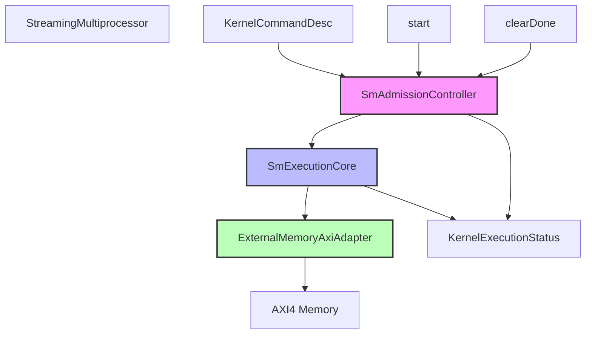
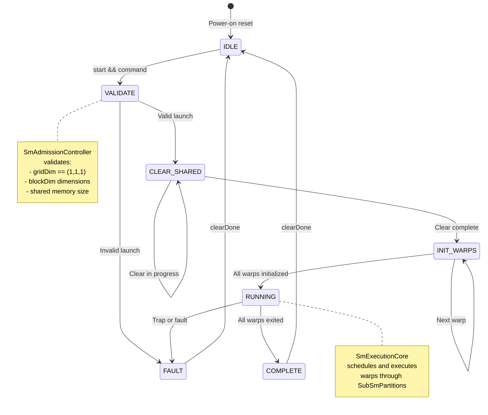
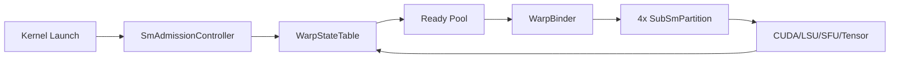
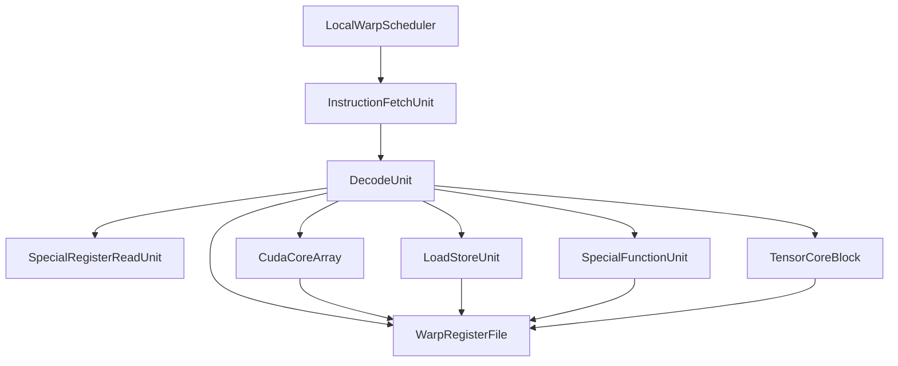
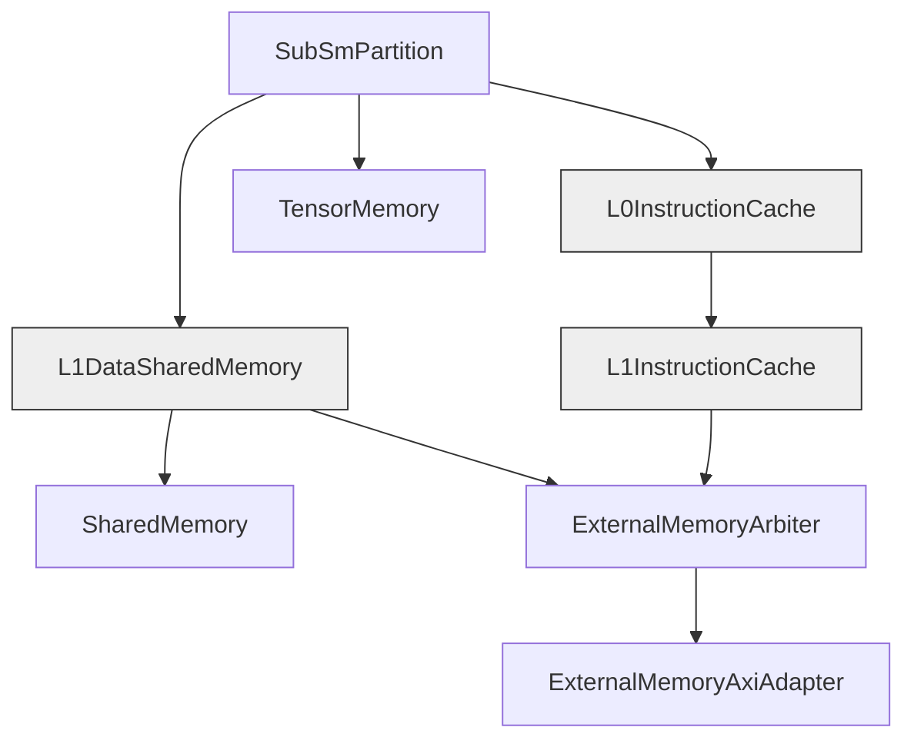
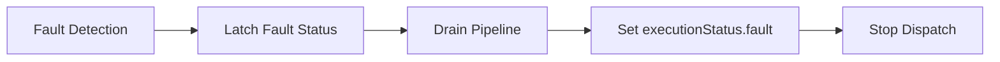

# StreamingMultiprocessor Subsystem

## Abstract

The **StreamingMultiprocessor** is a single-SM compatibility wrapper that provides a streamlined interface to the SpinalGPU execution core. It serves as the primary testing and development interface for kernel execution, wrapping the full SM execution pipeline (`SmExecutionCore`) with host control admission logic and AXI4 memory interconnect. While the chip-level `GpuCluster` supports multiple SMs, `StreamingMultiprocessor` maintains the legacy single-SM contract used by the existing kernel corpus and test harnesses.

## Background

### Why StreamingMultiprocessor Exists

The StreamingMultiprocessor addresses several key requirements in the SpinalGPU architecture:

1. **Testing Infrastructure**: Provides a stable, well-defined interface for the extensive kernel corpus and test suites developed around single-SM execution

2. **Development Workflow**: Offers a simplified single-SM environment for kernel development, debugging, and validation before scaling to multi-SM configurations

3. **Legacy Compatibility**: Preserves the original single-SM contract while the broader architecture evolves to support multi-SM clusters

4. **Host Interface**: Abstracts the complexity of CTA admission, warp initialization, and memory management into a clean command/status interface

### Problem It Solves

Before the chip-level cluster architecture, SpinalGPU operated as a single SM with direct kernel launch. As the architecture evolved to support multiple SMs with `GpuCluster`, the testing infrastructure needed:

- A backward-compatible single-SM wrapper for existing tests
- Simplified launch validation (single CTA with `gridDim = (1,1,1)`)
- Direct warp admission without cluster-level dispatch coordination
- AXI4 memory boundary matching the physical cluster interface

`StreamingMultiprocessor` solves this by wrapping `SmExecutionCore` with `SmAdmissionController` instead of the cluster-level `GridDispatchController` and `SmCtaController`.

## Architecture and Design

### High-Level Structure

The StreamingMultiprocessor consists of three main components:



### Component Responsibilities

#### SmAdmissionController
- Validates kernel launch parameters for single-SM execution
- Enforces `gridDim = (1,1,1)` constraint
- Initializes warp contexts from block dimensions
- Manages shared memory clear sequence
- Tracks kernel completion and fault status

#### SmExecutionCore
- Contains the full SM execution pipeline:
  - `WarpStateTable`: Architectural warp state storage
  - `WarpBinder`: Dynamic warp-to-partition binding
  - 4× `SubSmPartition`: Parallel warp execution units
  - `L1InstructionCache`: Shared instruction cache
  - `L1DataSharedMemory`: Shared memory arbitration
  - `SharedMemory`: SM-local scratchpad
  - `ExternalMemoryArbiter`: Instruction/data memory arbitration

#### ExternalMemoryAxiAdapter
- Bridges internal burst memory protocol to AXI4
- Handles address translation and burst coalescing
- Manages AXI transaction ordering and responses

### Internal Execution Flow



## Components and Features

### Interface Definition

#### Command Interface
```scala
case class StreamingMultiprocessorCommandIo(config: GpuConfig) extends Bundle {
  val command = in(KernelCommandDesc(config))      // Launch parameters
  val start = in Bool()                            // Launch trigger
  val clearDone = in Bool()                        // Status clear
  val executionStatus = out(KernelExecutionStatus) // Completion/fault
}
```

**KernelCommandDesc Fields:**
- `entryPc`: Entry point address (SpinalGPU machine code)
- `gridDim{X,Y,Z}`: Grid dimensions (must be 1,1,1)
- `blockDim{X,Y,Z}`: CTA/threadblock dimensions
- `argBase`: Base address for .param parameters
- `sharedBytes`: Shared memory size in bytes

**KernelExecutionStatus Fields:**
- `busy`: Kernel executing
- `done`: Kernel completed (success or fault)
- `fault`: Fault detected
- `faultPc`: Program counter at fault
- `faultCode`: Fault classification

#### Memory Interface
```scala
case class StreamingMultiprocessorIo(config: GpuConfig) extends Bundle {
  val memory = master(Axi4(config.axiConfig))  // AXI4 master port
  val command = StreamingMultiprocessorCommandIo(config)
  val debug = StreamingMultiprocessorDebugIo(config)
}
```

#### Debug Interface
Comprehensive observability signals for:
- Scheduled warp selection
- Fetch responses
- Decoded instructions
- Writeback packets
- Trap information
- Engine state and progress
- Sub-SM partition status
- Memory transaction validity

### Core Features

#### 1. Single-CTA Execution Model
- **Constraint**: Only one CTA per kernel launch
- **Validation**: `gridDim` must equal `(1,1,1)`
- **Warps**: Automatically computed from `blockDim`
  - Example: `blockDim = (40, 1, 1)` → 2 warps (32 + 8 lanes)

#### 2. Warp Admission and Scheduling


**Admission Process:**
1. Parse `blockDim` to compute thread count and warp count
2. Allocate `WarpContext` entries in `WarpStateTable`
3. Initialize each warp's PC, active mask, and thread base
4. Mark warps as runnable and add to ready pool

**Binding Process:**
1. `WarpBinder` scans ready pool for runnable warps
2. Assigns warp to an available sub-SM partition slot
3. Warp remains bound until completion or fault
4. Supports up to 8 resident warps (4 sub-SMs × 2 slots each)

#### 3. Sub-SM Partition Architecture

Each `SubSmPartition` is a complete warp execution engine:



**Partition Pipeline Stages:**
1. **Schedule**: Select next ready local warp slot (round-robin)
2. **Fetch**: Load instruction from PC via instruction cache
3. **Decode**: Parse instruction format and extract operands
4. **Issue**: Dispatch to execution unit based on opcode
5. **Execute**: Compute operation in CUDA core, LSU, SFU, or Tensor
6. **Writeback**: Update register file and warp context

#### 4. Memory Hierarchy



**Instruction Path:**
- Sub-SM → L0InstructionCache (per-partition placeholder)
- L0 → L1InstructionCache (shared arbitration point)
- L1 → ExternalMemoryArbiter
- Arbiter → ExternalMemoryAxiAdapter
- Adapter → AXI4 memory bus

**Data Path:**
- Sub-SM LSU → L1DataSharedMemory (shared arbitration)
- L1D → SharedMemory (SM-local scratchpad)
- L1D → TensorMemory (tensor fragment storage)
- L1D → ExternalMemoryArbiter
- Same downstream path as instructions

#### 5. Fault Detection and Handling

The StreamingMultiprocessor detects and reports multiple fault conditions:

| Fault Code | Description | Example Cause |
|------------|-------------|---------------|
| `trap` | Explicit trap instruction | `trap` opcode executed |
| `illegal_opcode` | Unimplemented instruction | Unknown machine opcode |
| `misaligned_fetch` | Unaligned PC | PC not word-aligned |
| `misaligned_store` | Unaligned store address | Store address not word-aligned |
| `non_uniform_branch` | Divergent branch | Lanes disagree on branch direction |
| `overflow` | Resource overflow | Too many warps for available slots |

**Fault Flow:**


### Configuration Parameters

The StreamingMultiprocessor uses `GpuConfig.default`:

```scala
GpuConfig(
  smCount = 1,                    // Single SM
  addressWidth = 32,              // Byte addressing
  threadCountWidth = 10,          // Up to 1024 threads per CTA
  warpIdWidth = 3,                // Up to 8 warps
  faultCodeWidth = 4,             // 16 fault codes
  axiConfig = Axi4Config(         // AXI4 configuration
    addressWidth = 32,
    dataWidth = 64,               // 64-bit data bus
    idWidth = 4
  ),
  sm = SmConfig.default           // SM-local configuration
)
```

**Derived SM Configuration:**
- Warp size: 32 lanes
- Sub-SM count: 4 partitions
- Resident warps per sub-SM: 2
- Total resident warps: 8
- Sub-SM issue width: 32 lanes (full warp)
- Total active CUDA lanes: 128 (4 × 32)
- Shared memory: 4 KiB, 32 banks
- Register file: 32 registers per thread

## Implementation and Usage

### Basic Usage Pattern

#### 1. Configuration Setup
```scala
val config = GpuConfig.default
val sm = new StreamingMultiprocessor(config)
```

#### 2. Memory Initialization
```scala
// Load kernel machine code
memory.writeBigInt(entryPc, kernelCode, byteCount)

// Load kernel arguments
memory.writeBigInt(argBase, arg0, 4)
memory.writeBigInt(argBase + 4, arg1, 4)
```

#### 3. Launch Configuration
```scala
sm.io.command.command.entryPc #= entryPc
sm.io.command.command.gridDimX #= 1
sm.io.command.command.gridDimY #= 1
sm.io.command.command.gridDimZ #= 1
sm.io.command.command.blockDimX #= blockDimX
sm.io.command.command.blockDimY #= blockDimY
sm.io.command.command.blockDimZ #= blockDimZ
sm.io.command.command.argBase #= argBase
sm.io.command.command.sharedBytes #= sharedBytes
```

#### 4. Kernel Execution
```scala
// Assert start for one cycle
sm.io.command.start #= true
clockDomain.waitSampling()
sm.io.command.start #= false

// Wait for completion
waitUntil(sm.io.command.executionStatus.done.toBoolean)
```

#### 5. Status Checking
```scala
val done = sm.io.command.executionStatus.done.toBoolean
val fault = sm.io.command.executionStatus.fault.toBoolean
val faultCode = sm.io.command.executionStatus.faultCode.toBigInt

if (fault) {
  val faultPc = sm.io.command.executionStatus.faultPc.toBigInt
  println(s"Kernel fault at PC=0x$faultPc, code=$faultCode")
}
```

#### 6. Result Verification
```scala
// Read output from global memory
val result = memory.readBigInt(outputAddress, 4)

// Clear status for next kernel
sm.io.command.clearDone #= true
clockDomain.waitSampling()
sm.io.command.clearDone #= false
```

### Integration with Kernel Corpus

The StreamingMultiprocessor integrates with the PTX kernel corpus through:

1. **PTX Compilation**: `PtxAssembler` lowers `.ptx` files to machine code
2. **Kernel Metadata**: `KernelCorpus` defines launch config and expectations
3. **Test Harness**: `KernelCorpusTestUtils` provides simulation runners
4. **Validation**: Automated checks against expected outputs

**Example Kernel Metadata:**
```scala
KernelDef(
  name = "vector_add_f32",
  ptxPath = "kernels/arithmetic/vector_add_f32.ptx",
  binaryPath = "generated/kernels/arithmetic/vector_add_f32.bin",
  launchConfig = KernelLaunchConfig(
    entryPc = 0x1000,
    gridDim = (1, 1, 1),
    blockDim = (256, 1, 1),
    argBase = 0x10000,
    sharedBytes = 0
  ),
  preload = Seq(
    MemoryRegion(0x1000, BinaryFile("vector_add_f32.bin")),
    MemoryRegion(0x20000, randomData(1024)),
    MemoryRegion(0x30000, randomData(1024))
  ),
  expectations = Seq(
    MemoryRegion(0x40000, expectedSum)
  ),
  coverage = TeachingLevel.Basic,
  category = "arithmetic"
)
```

## Examples

### Example 1: Simple Vector Addition

**PTX Source (`kernels/arithmetic/vector_add_f32.ptx`):**
```ptx
.version 6.0
.target spinalgpu
.address_size 32

.visible .entry vector_add_f32(
  .param .u32 ptr_a,
  .param .u32 ptr_b,
  .param .u32 ptr_c
)
{
  .reg .u32 %r1;
  .reg .f32 %f1, %f2, %f3, %f4;
  .reg .pred %p1;

  mov.u32 %r1, %tid.x;
  ld.global.f32 %f1, [%r1 + ptr_a];
  ld.global.f32 %f2, [%r1 + ptr_b];
  add.f32 %f3, %f1, %f2;
  st.global.f32 [%r1 + ptr_c], %f3;
  ret;
}
```

**Launch Sequence:**
```scala
// Compile PTX to machine code
val kernelBinary = PtxAssembler.assemble("vector_add_f32.ptx")

// Setup memory
memory.writeBigInt(0x1000, kernelBinary, kernelBinary.length)
memory.writeBigInt(0x20000, inputA, 1024 * 4)  // 1024 floats
memory.writeBigInt(0x30000, inputB, 1024 * 4)
memory.writeBigInt(0x40000, 0, 1024 * 4)      // Output buffer

// Configure kernel
sm.io.command.command.entryPc #= 0x1000
sm.io.command.command.blockDimX #= 256
sm.io.command.command.argBase #= 0x50000

// Write parameters
memory.writeBigInt(0x50000, 0x20000, 4)  // ptr_a
memory.writeBigInt(0x50004, 0x30000, 4)  // ptr_b
memory.writeBigInt(0x50008, 0x40000, 4)  // ptr_c

// Launch
pulseStart(sm)
waitUntil(sm.io.command.executionStatus.done.toBoolean)

// Verify
assert(!sm.io.command.executionStatus.fault.toBoolean)
val result = memory.readBigInt(0x40000, 1024 * 4)
validateResult(result)
```

### Example 2: Matrix Multiplication with Shared Memory

**PTX Source:**
```ptx
.version 6.0
.target spinalgpu
.address_size 32

.visible .entry matrix_mul_shared(
  .param .u32 ptr_a,
  .param .u32 ptr_b,
  .param .u32 ptr_c,
  .param .u32 N
)
{
  .reg .u32 %r1, %r2, %r3, %r4, %r5, %r6;
  .reg .f32 %f1, %f2, %f3, %f4, %f5;
  .reg .pred %p1;

  // Shared memory tile buffers
  .shared .align 4 .b8 As[1024];
  .shared .align 4 .b8 Bs[1024];

  // Compute row and column indices
  mov.u32 %r1, %tid.x;  // Local thread ID
  mov.u32 %r2, %ctaid.x; // Block ID
  mov.u32 %r3, N;

  // Load tile from A into shared memory
  // ... (omitted for brevity)

  // Synchronize (placeholder - actual sync not implemented)
  // bar.sync 0;

  // Compute partial dot product
  // ... (omitted for brevity)

  // Write result
  st.global.f32 [%r4 + ptr_c], %f5;
  ret;
}
```

**Launch Configuration:**
```scala
// Configure for 32x32 tiles with 256 threads per block
sm.io.command.command.blockDimX #= 256
sm.io.command.command.blockDimY #= 1
sm.io.command.command.blockDimZ #= 1
sm.io.command.command.gridDimX #= 8  // For 256x256 matrix (8x8 tiles)
sm.io.command.command.gridDimY #= 8
sm.io.command.command.sharedBytes #= 2048  // Two 1024-byte tiles
```

### Example 3: Fault Detection

**Illegal Opcode Kernel:**
```ptx
.version 6.0
.target spinalgpu
.address_size 32

.visible .entry illegal_opcode_kernel() {
  .reg .u32 %r1;
  // Opcode 0xFF is not implemented
  .b32 0xFFFFFFFF;  // Will be fetched and decoded
  ret;
}
```

**Expected Behavior:**
```scala
pulseStart(sm)
waitUntil(sm.io.command.executionStatus.done.toBoolean)

// Should complete with fault
assert(sm.io.command.executionStatus.done.toBoolean)
assert(sm.io.command.executionStatus.fault.toBoolean)
assert(sm.io.command.executionStatus.faultCode.toBigInt == FaultCode.IllegalOpcode)

// Fault PC should point to the illegal instruction
val faultPc = sm.io.command.executionStatus.faultPc.toBigInt
assert(faultPc == entryPc)  // First instruction
```

### Example 4: Multi-Warp Execution

**Configuration:**
```scala
// blockDim = (64, 1, 1) → 2 warps (32 + 32 lanes)
sm.io.command.command.blockDimX #= 64

// Execution trace:
// Cycle 0: Warp 0 scheduled, PC=entryPc
// Cycle 1: Warp 0 fetch
// Cycle 2: Warp 0 decode/issue
// Cycle 3: Warp 1 scheduled, PC=entryPc
// Cycle 4: Warp 1 fetch
// ...
```

**Warp Assignment:**
- Warp 0: lanes 0-31, `threadBase = 0`
- Warp 1: lanes 32-63, `threadBase = 32`

Both warps execute concurrently on different sub-SM partitions.

## Considerations

### Performance Considerations

#### Throughput Characteristics

**Instruction Throughput:**
- Sub-SM partition: 1 warp instruction per cycle (when pipelined)
- Full SM: 4 warp instructions per cycle (4 partitions in parallel)
- Sustained throughput limited by:
  - Execution unit latency (CUDA core: 4 cycles for FP32)
  - Memory access latency
  - Warp availability and ready conditions

**FP16 Arithmetic Throughput:**
Per partition at frequency `f` GHz:
- FP16 scalar add/mul: `32 lanes × 1 FLOP / 4 cycles = 8 × f` GFLOP/s
- FP16 scalar FMA: `32 lanes × 2 FLOPs / 4 cycles = 16 × f` GFLOP/s
- FP16 packed f16x2 add/mul: `32 lanes × 2 FLOPs / 4 cycles = 16 × f` GFLOP/s

**Full SM Throughput (4 partitions):**
- FP16 scalar FMA: `4 × 16 × f = 64 × f` GFLOP/s

#### Memory Bandwidth

**AXI4 Interface:**
- Data width: 64 bits (8 bytes)
- Maximum theoretical bandwidth: `8 bytes × f GHz = 8 × f` GB/s

**Coalescing:**
- Contiguous 32-bit word accesses from active lanes coalesce into bursts
- Misaligned or sparse accesses reduce efficiency

**Shared Memory:**
- 4 KiB, 32 banks
- Bank conflicts on simultaneous accesses to same bank
- Latency: 1 cycle (ideal), more with conflicts

### Scalability Considerations

#### Single-SM Limitations

The StreamingMultiprocessor is intentionally limited:
- **CTA Count**: Exactly 1 per kernel launch
- **Grid Dimensions**: Must be `(1,1,1)`
- **Warp Count**: Maximum 8 resident warps
- **Thread Count**: Maximum 1024 threads per CTA

#### Scaling to Multi-SM

For larger grids:
- Use `GpuCluster` with `smCount > 1`
- `GridDispatchController` walks 3D CTA grids
- Each SM executes one CTA independently
- CTAs dispatched round-robin to idle SMs

#### Configuration Scaling

Key parameters to tune for different use cases:
```scala
SmConfig(
  warpSize = 32,                    // Fixed
  subSmCount = 4,                   // Increase for more parallelism
  residentWarpsPerSubSm = 2,        // Increase for more warps
  sharedMemorySize = 4096,          // Increase for larger tiles
  registerFileSize = 32,            // Increase for more registers
  sharedMemoryBanks = 32            // Adjust for access patterns
)
```

### Security Considerations

#### Fault Isolation

The StreamingMultiprocessor provides fault detection but not isolation:
- **Fault Detection**: All fault types are trapped and reported
- **No Fault Recovery**: Fault state latches until `clearDone`
- **No Privilege Levels**: All code runs at same privilege level
- **No Memory Protection**: No MMU or address translation

#### Resource Exhaustion

Potential denial-of-service vectors:
- **Infinite Loops**: No watchdog timer
- **Shared Memory**: Exceeding `sharedBytes` causes launch validation failure
- **Register Pressure**: Spilling to memory not implemented
- **Warp Count**: Exceeding capacity causes overflow fault

### Debugging Considerations

#### Debug Interface

The extensive debug interface enables detailed inspection:
- **Scheduled Warp**: Which warp is currently executing
- **Fetch Response**: Raw instruction bits from memory
- **Decoded Instruction**: Parsed instruction fields
- **Writeback Packet**: Register write results
- **Trap Information**: Fault details
- **Engine State**: Pipeline stage state
- **Sub-SM Status**: Per-partition warp binding and execution state

#### Common Debug Patterns

**Stall Detection:**
```scala
// Check if pipeline is stalled
if (sm.io.debug.engineState.toBigInt == EngineState.WAIT_CUDA) {
  println("Waiting for CUDA core completion")
}
```

**Warp Progress:**
```scala
// Track warp PC progression
val warpId = sm.io.debug.selectedWarpId.toBigInt
val pc = sm.io.debug.selectedPc.toBigInt
println(s"Warp $warpId at PC 0x${pc.toString(16)}")
```

**Memory Transaction Monitoring:**
```scala
// Monitor LSU activity
val lsuIssue = sm.io.debug.lsuIssueValid.toBoolean
val lsuResp = sm.io.debug.lsuResponseValid.toBoolean
if (lsuIssue && !lsuResp) {
  println("LSU request pending")
}
```

### Testing Considerations

#### Test Categories

1. **Unit Tests**: Individual module verification
   - `CudaCoreArraySpec`: CUDA core operations
   - `LoadStoreUnitSpec`: Memory operations
   - `TensorCoreBlockSpec`: Tensor operations

2. **Integration Tests**: Full SM execution
   - `StreamingMultiprocessorSimSpec`: Basic execution
   - `StreamingMultiprocessorKernelCorpusSpec`: Kernel corpus validation
   - `StreamingMultiprocessorPartitionCoverageSpec`: Partition coverage

3. **System Tests**: Multi-SM cluster
   - `GpuTopSimSpec`: Full chip execution
   - `MultiSmGpuTopSpec`: Multi-SM coordination

#### Coverage Metrics

The StreamingMultiprocessor achieves coverage of:
- **ISA Features**: All documented PTX subset instructions
- **Execution Paths**: Fault handling, warp scheduling, memory access
- **Data Types**: FP32, FP16, FP8, integers, vectors
- **Control Flow**: Uniform branches, loops, exits
- **Memory Spaces**: Global, shared, param

### Future Evolution

#### Planned Enhancements

1. **Pipeline Improvements**:
   - Fully pipelined execution units
   - Out-of-order issue capability
   - Scoreboarding for register hazards

2. **Memory Enhancements**:
   - Real L1/L2 cache behavior
   - Cache coherence protocol
   - Improved coalescing logic

3. **SIMT Features**:
   - Reconvergence stack for divergent branches
   - Independent thread scheduling
   - Thread-level parallelism optimizations

4. **Debug Support**:
   - Hardware breakpoints
   - Performance counters
   - Trace buffer

#### Migration Path to GpuCluster

When moving from StreamingMultiprocessor to GpuCluster:
1. Replace `StreamingMultiprocessor` with `GpuCluster`
2. Update grid dimensions to actual 3D grid
3. Remove `gridDim == (1,1,1)` constraint
4. Handle multi-SM coordination in tests
5. Consider CTA scheduling and load balancing

## Summary

The StreamingMultiprocessor provides a robust, well-tested single-SM execution environment that serves as the foundation for SpinalGPU kernel development and validation. Its clean interface, comprehensive debug capabilities, and extensive test coverage make it an ideal platform for GPU architecture exploration and kernel development.

Key strengths:
- **Simplicity**: Single-SM model easy to understand and debug
- **Testability**: Extensive debug interface and test infrastructure
- **Compatibility**: Preserves existing test corpus
- **Extensibility**: Clear path to multi-SM cluster architecture

The subsystem successfully bridges the gap between low-level hardware design and high-level kernel programming, enabling rapid iteration on both hardware microarchitecture and software algorithms.
