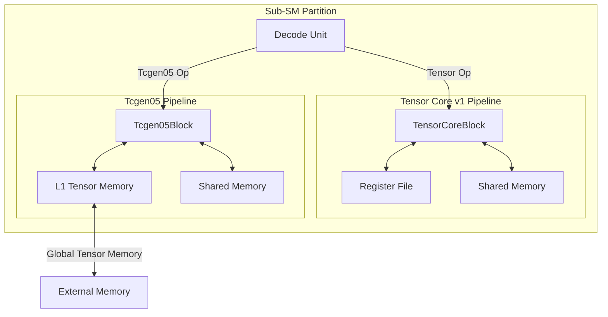
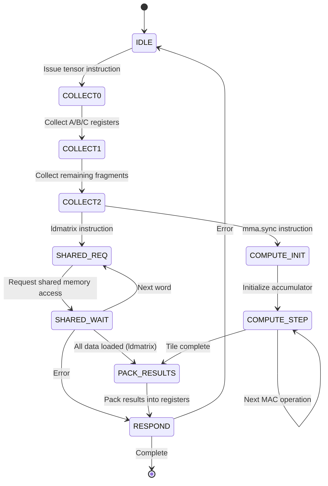
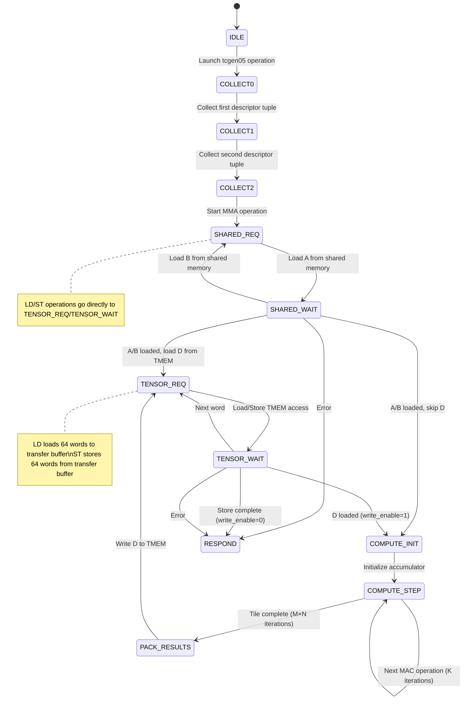
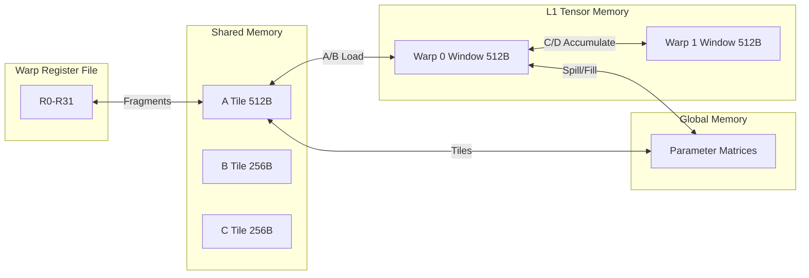

# Tensor Core Subsystem

## Abstract

The Tensor Core subsystem in SpinalGPU provides hardware-accelerated matrix multiply-accumulate (MMA) operations for deep learning workloads. The implementation supports two generations of tensor operations: legacy Tensor Core v1 (synchronous MMA with fragment registers) and Tcgen05 (descriptor-driven asynchronous MMA with dedicated Tensor Memory). Both generations execute 16×8×16 FP16 matrix tiles using warp-synchronous SIMD parallelism across 32 threads, delivering up to 128 FP16 multiply-accumulate operations per cycle.

## Background

Tensor Cores were introduced by NVIDIA in Volta GPUs to accelerate the matrix operations that dominate deep learning training and inference. In neural networks, the majority of computation occurs in matrix multiplications within fully-connected layers and convolutions. Traditional CUDA cores execute these operations scalar-by-scalar, requiring thousands of instructions for a single tile.

Tensor Cores solve this problem by performing a matrix multiply-accumulate operation in a single instruction: `D = A × B + C`, where A is 16×16, B is 16×8 (or 8×16), and C/D are 16×8 matrices. This maps directly to the 32-thread warp structure, where each thread holds fragments of the input and output matrices in registers.

The SpinalGPU implementation models two architectural approaches:

1. **Tensor Core v1** (Volta/Turing style): Synchronous `mma.sync` instruction where all matrix fragments reside in general-purpose registers. The warp explicitly loads fragments with `ldmatrix`, computes with `mma.sync`, and stores results with `stmatrix`.

2. **Tcgen05** (Blackwell style): Asynchronous descriptor-driven MMA where accumulator matrices live in dedicated Tensor Memory (TMEM). The warp issues `tcgen05.mma` with shared-memory descriptors for A/B and TMEM addresses for C/D, then commits the operation and waits for completion.

## Architecture

### High-Level Structure



### Tensor Core v1 State Machine



### Tcgen05 State Machine



### Memory Hierarchy



## Components

### TensorCoreBlock (v1)

The `TensorCoreBlock` implements synchronous tensor operations compatible with NVIDIA's Volta/Turing PTX ISA.

**Key Features:**
- **Tile Dimensions:** 16×8×16 (M=16 rows, N=8 columns, K=16 inner dimension)
- **Data Format:** FP16 (16-bit half precision floating point)
- **Compute:** 2,048 FP16 multiply-accumulate operations per MMA instruction
- **Register Layout:** 4 registers for A (128 FP16 values), 2 for B (64 FP16), 2 for C/D (64 FP16)

**Instructions Supported:**
- `LDMATRIX_X4`: Load 8×8 tile from shared memory into 4 registers (32 FP16)
- `LDMATRIX_X2`: Load 8×8 tile into 2 registers (16 FP16)
- `LDMATRIX_X2_TRANS`: Load and transpose 8×8 tile
- `MMA_SYNC_F16_F16_F16_F16`: Matrix multiply-accumulate D += A × B
- `STMATRIX_X2`: Store 8×8 tile to shared memory

**State Machine:**
The block operates as a synchronous state machine with the following phases:
1. **COLLECT0-2**: Gather source registers containing matrix fragments
2. **SHARED_REQ/WAIT**: Perform shared memory loads/stores for ldmatrix/stmatrix
3. **COMPUTE_INIT**: Initialize accumulator matrix from C fragments
4. **COMPUTE_STEP**: Iterate through M×N×K dimensions computing MAC operations
5. **PACK_RESULTS**: Distribute accumulator values back to destination registers

### Tcgen05Block (Blackwell-style)

The `Tcgen05Block` implements asynchronous descriptor-driven tensor operations inspired by NVIDIA's Blackwell architecture.

**Key Features:**
- **Same Tile Dimensions:** 16×8×16 FP16 tile
- **Descriptor-Based:** A/B matrices addressed via shared-memory descriptors
- **TMEM-Backed:** C/D accumulator matrices reside in dedicated Tensor Memory
- **Asynchronous:** Operations launch, wait for commit, then complete

**Instructions Supported:**
- `TCGEN05_LD_32X32B_X2`: Load 64 words (256 bytes) from TMEM to registers
- `TCGEN05_ST_32X32B_X2`: Store 64 words from registers to TMEM
- `TCGEN05_WAIT_LD`: Wait for load completion
- `TCGEN05_WAIT_ST`: Wait for store completion
- `TCGEN05_MMA_CTA1_F16`: Launch MMA operation with descriptors
- `TCGEN05_COMMIT_CTA1`: Commit pending MMA operations

**Operation Flow:**
1. Warp prepares descriptors: A/B base addresses in shared memory, D base in TMEM
2. `tcgen05.mma` launches the operation:
   - Load A matrix from shared memory (128 FP16 values)
   - Load B matrix from shared memory (64 FP16 values)
   - Optionally load D accumulator from TMEM (64 FP16 values)
   - Compute D += A × B (16×8×16 MAC operations)
   - Store result back to TMEM
3. `tcgen05.commit` makes the operation visible to CTA group
4. Warp continues execution while MMA computes asynchronously
5. `tcgen05.wait.st` ensures TMEM write completes before dependent operations

### TensorMemory

The `TensorMemory` component implements the global Tensor Memory array shared across all warps in the SM.

**Configuration:**
- **Capacity:** 512 bytes per warp (configurable via `tensorMemoryBytesPerWarp`)
- **Total:** `tensorMemoryBytesPerWarp × residentWarpCount` bytes
- **Word Width:** 32 bits (matches machine data width)
- **Access:** Single-ported read/write with synchronous read

**Interface:**
- `TensorMemReq`: Address, write enable, write data
- `TensorMemRsp`: Read data, completion flag, error flag
- `TensorMemoryClearIo`: Bulk zero-initialization for CTA startup

**Address Mapping:**
Each warp has a dedicated window in TMEM:
```
warpBaseAddress = warpId × tensorWordsPerWarp
localAddress = warpBaseAddress + offset
```

### L1TensorMemory

The `L1TensorMemory` acts as an arbiter and request router between multiple sub-SMs and the global Tensor Memory.

**Features:**
- **Round-Robin Arbitration:** Fair access among sub-SMs
- **Request Buffering:** Single outstanding request per sub-SM
- **Response Routing:** Direct responses to originating sub-SM
- **Idle Detection:** Signals when no requests are pending

**Flow:**
```mermaid
sequenceDiagram
    subSM1[Sub-SM 0] as SM0
    subSM2[Sub-SM 1] as SM1
    l1[L1 Tensor Memory] as L1
    tmem[Tensor Memory] as TMEM

    SM0->>L1: Request (valid=True)
    SM1->>L1: Request (valid=True)

    L1->>L1: Round-robin: select SM0
    L1->>TMEM: Forward SM0 request
    L1-->>SM1: Request (ready=False)

    TMEM-->>L1: Response
    L1-->>SM0: Response

    L1->>L1: Round-robin: select SM1
    L1->>TMEM: Forward SM1 request
    TMEM-->>L1: Response
    L1-->>SM1: Response
```

## Data Layouts

### Tensor Core v1 Fragment Layout

The 16×8×16 tile is distributed across 32 threads and 4-8 registers per thread.

**Matrix A (16×16):**
- Split into four 8×8 tiles
- Each 8×8 tile maps to 4 registers (R0-R3)
- Each register holds 8 FP16 values (one per 4-thread group)
- Layout: Row-major within each 8×8 tile
```scala
// For A[row, col]:
register = aRegister(row, col)  // 0-3 based on tile position
lane = aLane(row, col)          // Thread lane 0-31
half = aHalf(col)               // 0=lower 16b, 1=upper 16b
```

**Matrix B (16×8):**
- Split into two 8×8 tiles stacked vertically
- Each tile maps to 2 registers (R0-R1)
- Layout: Column-major to facilitate A×B multiplication
```scala
// For B[row, col]:
register = bRegister(row)       // 0 or 1 based on row >= 8
lane = bLane(row, col)          // Thread lane 0-31
half = bHalf(row)               // 0=lower 16b, 1=upper 16b
```

**Matrix C/D (16×8):**
- Same layout as B (2 registers, column-major)
- Overwritten in-place by MMA result

### Shared Memory Layout for LDMATRIX

`ldmatrix` loads 8×8 FP16 tiles from shared memory in row-major format.

**Without Transpose:**
```
Shared Memory (row-major 32-bit words):
Word 0:  [row0,col0] [row0,col1]  // FP16 pairs
Word 1:  [row0,col2] [row0,col3]
...
Word 7:  [row0,col14] [row0,col15]
Word 8:  [row1,col0] [row1,col1]
...
Word 63: [row7,col14] [row7,col15]

Register Layout (after ldmatrix.x4):
R0: Words 0,8,16,24 packed by lane
R1: Words 1,9,17,25 packed by lane
R2: Words 2,10,18,26 packed by lane
R3: Words 3,11,19,27 packed by lane
```

**With Transpose (ldmatrix.x2.trans):**
Transforms row-major layout to column-major for B matrix multiplication.

### Tcgen05 TMEM Layout

Tcgen05 uses a 64-word (256-byte) transfer buffer compatible with TMEM alignment.

**Transfer Buffer:**
```
Words 0-31:   Lower half of 16×8 D matrix
Words 32-63:  Upper half of 16×8 D matrix
```

Each word contains two FP16 values packed in little-endian format:
- Bits [15:0]: First FP16 value
- Bits [31:16]: Second FP16 value

## Implementation Details

### FP16 FMA Computation

The core compute operation uses FP16 fused multiply-add:

```scala
// In TensorCoreBlock.scala, line 100:
currentComputeNext = Fp16Math.fma(currentComputeA, currentComputeB, currentComputeAcc)
```

The `Fp16Math.fma` function:
1. Converts FP16 inputs to FP32
2. Performs FP32 fused multiply-add: `result = (a × b) + c`
3. Converts FP32 result back to FP16 with proper rounding
4. Handles denormals, infinities, and NaN according to IEEE 754-2008

**Compute Iteration:**
```scala
// Iterates M×N×K = 16×8×16 = 2,048 MAC operations
for (row <- 0 until M) {          // 16 rows of D
  for (col <- 0 until N) {        // 8 columns of D
    for (k <- 0 until K) {        // 16 inner dimension
      val a = A(row, k)
      val b = B(k, col)
      val c = D(row, col)
      D(row, col) = fma(a, b, c)  // D += A × B
    }
  }
}
```

### Memory Access Patterns

**LDMATRIX (Shared Memory Load):**
- 32 threads collaboratively load 256 bytes (64 FP16 values)
- Each thread loads 2 words (8 FP16) in ldmatrix.x4
- Address calculation:
```scala
baseLane = (matrixIndex × 8)  // 0 or 8 for x4, 0 for x2
laneRow = (laneIndex >> 2)    // 0-7
laneOffset = (laneIndex & 0x3) << 2
address = baseLane + laneRow + laneOffset
```

**STMATRIX (Shared Memory Store):**
- Inverse of ldmatrix layout
- Same addressing pattern, write direction instead of read

**Tcgen05 TMEM Load/Store:**
- Warp-wide uniform address (all lanes must agree)
- 64 sequential word transfers
- Address window per warp:
```scala
warpWindowBase = warpId × tensorWordsPerWarp
localAddress = baseByte[log2Up(tensorWordsPerWarp)+1:2]
finalAddress = warpWindowBase + localAddress + wordOffset
```

### Pipeline Integration

**Decode Unit:**
```scala
// In DecodeUnit.scala, line 172:
when(opcodeUInt >= Opcode.tensorBase && opcodeUInt <= Opcode.tensorLast) {
  decoded.target := ExecutionUnitKind.TENSOR
}
```

**Sub-SM Partition:**
Routes tensor operations to the appropriate execution unit:
- Volta-style opcodes (0x50-0x54) → TensorCoreBlock
- Tcgen05 opcodes (0x55-0x5A) → Tcgen05Block

**Register Read/Write:**
Tensor operations own the register file during multi-cycle execution:
```scala
io.ownsRegisterReads := state === State.COLLECT0 ||
                       state === State.COLLECT1 ||
                       state === State.COLLECT2
```

## Examples

### Volta-Style MMA (tensor_mma_f16_f16_f16.ptx)

This example demonstrates the complete tensor core pipeline: load A/B/C matrices, compute D = A×B+C, store results.

```ptx
// Setup: Load matrices from global to shared memory
ld.global.u32 %r10, [%a_ptr + %lane_offset];
st.shared.u32 [a_tile + %lane_offset], %r10;
// ... (repeat for all tiles)

// Load fragments from shared memory to registers
ldmatrix.sync.aligned.m8n8.x4.shared::cta.b16 {%x0,%x1,%x2,%x3}, [%a_ptr];
ldmatrix.sync.aligned.m8n8.x2.trans.shared::cta.b16 {%x4,%x5}, [%b_ptr];
ldmatrix.sync.aligned.m8n8.x2.shared::cta.b16 {%x6,%x7}, [%c_ptr];

// Compute D = A × B + C (16×8×16 FP16 MAC operations)
mma.sync.aligned.m16n8k16.row.col.f16.f16.f16.f16
    {%x8,%x9}, {%x0,%x1,%x2,%x3}, {%x4,%x5}, {%x6,%x7};

// Store result back to shared memory
stmatrix.sync.aligned.m8n8.x2.shared::cta.b16 [%d_ptr], {%x8,%x9};
```

**Execution Timeline:**
1. Cycles 0-3: ldmatrix.x4 loads 128 FP16 values (4 registers)
2. Cycles 4-5: ldmatrix.x2 loads 64 FP16 values (2 registers)
3. Cycles 6-7: ldmatrix.x2 loads C accumulator (2 registers)
4. Cycles 8-2071: MMA computes 2,048 MAC operations
5. Cycles 2072-2073: stmatrix stores 64 FP16 values (2 registers)

**Total:** ~2,074 cycles for one 16×8×16 tile

### Blackwell-Style MMA (tcgen05_mma_f16.ptx)

This example shows descriptor-driven asynchronous MMA with TMEM backing.

```ptx
// Setup: A and B in shared memory, C in TMEM
mov.u32 %a_desc0, a_tile;
mov.u32 %a_desc1, 0;           // Stride/extension (unused in this slice)
mov.u32 %b_desc0, b_tile;
mov.u32 %b_desc1, 0;
mov.u32 %d_base, 0;            // TMEM offset for this warp
mov.u32 %control, 17;          // 0x11 = FP16 MMA + load D from TMEM

// Seed TMEM with accumulator matrix C
ld.global.u32 %r14, [%c_ptr];   // Load first 32 bytes
ld.global.u32 %r15, [%c_ptr+4]; // Load second 32 bytes
tcgen05.st.sync.aligned.32x32b.x2.b32 [%d_base], {%r14,%r15};
tcgen05.wait::st.sync.aligned;

// Launch asynchronous MMA operation
tcgen05.mma.cta_group::1.kind::f16
    [%d_base],              // D accumulator address in TMEM
    {%a_desc0,%a_desc1},    // A matrix descriptor
    {%b_desc0,%b_desc1},    // B matrix descriptor
    {%control,0};           // Control tuple

// Commit makes the operation visible to CTA group
tcgen05.commit.cta_group::1.sync.aligned;

// ... warp can do other work here ...

// Reload result from TMEM
tcgen05.ld.sync.aligned.32x32b.x2.b32 {%r14,%r15}, [%d_base];
tcgen05.wait::ld.sync.aligned;

// Store result to global memory
st.global.u32 [%d_ptr], %r14;
st.global.u32 [%d_ptr+4], %r15;
```

**Execution Timeline:**
1. Cycles 0-1: Load C from global memory
2. Cycles 2-3: Store C to TMEM via tcgen05.st
3. Cycles 4-5: tcgen05.mma launches operation
4. Cycles 6-6: tcgen05.commit synchronizes CTA group
5. Cycles 7-2068: MMA computes asynchronously in background
6. Cycles 2069-2072: tcgen05.ld reads result from TMEM
7. Cycles 2073-2074: Store D to global memory

**Key Difference:** Warp continues execution after commit while MMA computes in background.

## Performance Considerations

### Throughput Calculations

**Theoretical Peak Performance:**
- Operations per MMA: M × N × K = 16 × 8 × 16 = 2,048 FP16 MACs
- Clock frequency: Assume 1.5 GHz (conservative for modern GPUs)
- Single Tensor Core throughput: 2,048 × 1.5 GHz = 3.07 TFLOPS
- Per-SM throughput (with 4 sub-SMs): 4 × 3.07 = 12.3 TFLOPS

**Comparison to CUDA Cores:**
- CUDA core FMA: 1 FP32 operation per cycle per lane
- Warp (32 lanes): 32 FP32 FMA per cycle = 48 GFLOPS at 1.5 GHz
- Tensor Core speedup: 3.07 TFLOPS / 48 GFLOPS = ~64×

### Memory Bandwidth Requirements

**Shared Memory Bandwidth:**
- Ldmatrix.x4: 256 bytes per load
- Ldmatrix.x2: 128 bytes per load
- MMA requires 3 loads (A, B, C): 256 + 128 + 128 = 512 bytes
- At 1 cycle per load: 512 GB/s per SM at 1 GHz

**TMEM Bandwidth (Tcgen05):**
- TC load/store: 256 bytes per transfer
- Two transfers per MMA (load D, store D): 512 bytes
- Same order of magnitude as shared memory bandwidth

**Register File Pressure:**
- Volta MMA: 8 registers for A, 4 for B, 4 for C/D = 16 registers
- Tcgen05 MMA: 4 registers for A/B descriptors, 2 for D buffer = 6 registers
- Tcgen05 reduces register pressure by ~2.5×

### Data Coalescing

**Optimal Access Patterns:**
- All 32 threads should access contiguous shared memory locations
- Addresses should be 16-byte aligned (4×32-bit words)
- Bank conflicts occur when multiple threads access same bank

**Ldmatrix Coalescing:**
```
Thread 0-7:   Words 0, 8, 16, 24   (rows 0-7, cols 0-1)
Thread 8-15:  Words 1, 9, 17, 25   (rows 0-7, cols 2-3)
Thread 16-23: Words 2, 10, 18, 26  (rows 0-7, cols 4-5)
Thread 24-31: Words 3, 11, 19, 27  (rows 0-7, cols 6-7)
```
Each thread accesses different shared memory banks → no conflicts.

### Sparsity Support

**Current Implementation:** Dense matrices only

**Future Extensions (Planned):**
- 2:4 structured sparsity (as in NVIDIA Ampere)
- Mask-based sparse MMA
- Zero-skipping optimization
- Expected throughput: 2× dense performance for sparse matrices

## Configuration and Tuning

### SmConfig Parameters

```scala
case class SmConfig(
  // ...
  tensorCoreCount: Int = 1,              // Tensor cores per sub-SM
  tensorMemoryBytesPerWarp: Int = 512,   // TMEM capacity per warp
  // ...
)
```

**Tuning Guidelines:**
- Increase `tensorMemoryBytesPerWarp` for larger accumulator tiles
- Multiple `tensorCoreCount` for wider SIMD (requires architectural changes)
- Balance TMEM size with shared memory to avoid bank conflicts

### Tile Size Selection

The 16×8×16 tile size was chosen for:
1. **Warp Alignment:** 32 threads can evenly distribute 16×8 matrices
2. **Register Pressure:** Fits in 16 registers without spilling
3. **Shared Memory Lines:** Aligns with 128-byte cache lines
4. **Compute Intensity:** 2,048 operations amortizes memory overhead

**Alternative Tiles** (future work):
- 32×32×16 (Hopper-style): Higher throughput, more registers
- 8×8×16 (smaller): Lower latency, less register pressure
- BF16/TF32/FP8 variants: Different precision, same tile dimensions

## ISA Reference

### Tensor Core v1 Opcodes

| Opcode | Value | Instruction | Description |
|--------|-------|-------------|-------------|
| LDMATRIX_X4 | 0x50 | ldmatrix.sync.aligned.m8n8.x4 | Load 8×8 tile into 4 registers |
| LDMATRIX_X2_TRANS | 0x51 | ldmatrix.sync.aligned.m8n8.x2.trans | Load and transpose 8×8 tile |
| LDMATRIX_X2 | 0x52 | ldmatrix.sync.aligned.m8n8.x2 | Load 8×8 tile into 2 registers |
| MMA_SYNC_F16_F16_F16_F16 | 0x53 | mma.sync.aligned.m16n8k16 | Matrix multiply-accumulate |
| STMATRIX_X2 | 0x54 | stmatrix.sync.aligned.m8n8.x2 | Store 8×8 tile to shared memory |

### Tcgen05 Opcodes

| Opcode | Value | Instruction | Description |
|--------|-------|-------------|-------------|
| TCGEN05_LD_32X32B_X2 | 0x55 | tcgen05.ld.sync.aligned.32x32b.x2 | Load 64 words from TMEM |
| TCGEN05_ST_32X32B_X2 | 0x56 | tcgen05.st.sync.aligned.32x32b.x2 | Store 64 words to TMEM |
| TCGEN05_WAIT_LD | 0x57 | tcgen05.wait::ld.sync.aligned | Wait for TMEM load completion |
| TCGEN05_WAIT_ST | 0x58 | tcgen05.wait::st.sync.aligned | Wait for TMEM store completion |
| TCGEN05_MMA_CTA1_F16 | 0x59 | tcgen05.mma.cta_group::1.kind::f16 | Launch descriptor-driven MMA |
| TCGEN05_COMMIT_CTA1 | 0x5A | tcgen05.commit.cta_group::1 | Commit pending MMA operations |

## Integration Notes

### Writing Tensor Kernels

**Best Practices:**
1. Always use full warp masks (all 32 threads active)
2. Ensure 16-byte alignment for all shared memory addresses
3. Prefetch next tile while computing current tile (software pipelining)
4. Use `ldmatrix.x4` for A matrix to maximize bandwidth
5. Use transposed loads for B matrix to match multiply layout

**Common Pitfalls:**
- Misaligned addresses → FaultCode.MisalignedLoadStore
- Partial warp masks → FaultCode.TensorProtocol
- Out-of-bounds TMEM access → FaultCode.TensorMemory
- Non-uniform addresses across lanes → protocol violation

### Debugging Tensor Operations

**Fault Codes:**
```scala
val FaultCode = {
  val None = 0x00
  val TensorProtocol = 0x01       // Invalid warp mask or non-uniform values
  val MisalignedLoadStore = 0x02  // Address not 16-byte aligned
  val TensorMemory = 0x03         // Out-of-bounds TMEM access
  val ExternalMemory = 0x04       // Shared memory access error
}
```

**Verification Strategy:**
1. Unit tests: Verify individual MMA operations with known matrices
2. Integration tests: Test load-compute-store pipeline
3. Golden reference: Compare against CUDA cores implementation
4. Random testing: Fuzz testing with random matrix values

## Future Directions

### Planned Enhancements

1. **BF16 Support:** BFloat16 format for better dynamic range
2. **TF32 Support:** TensorFloat-32 for AI training (19-bit mantissa)
3. **FP8 Support:** 8-bit floating point for inference acceleration
4. **INT8 Support:** Integer matrix operations for quantized models
5. **Sparsity:** 2:4 structured sparsity for 2× throughput improvement
6. **Larger Tiles:** 32×32×16 for Hopper-class performance
7. **Accumulator Scaling:** Per-channel scaling for quantized inference

### Performance Optimizations

1. **Dual-Issue MMA:** Overlap memory transfers with computation
2. **Tensor Pipelining:** Queue multiple MMA operations
3. **Warp Specialization:** Separate warps for load/compute/store
4. **Register Tiling:** Keep multiple tiles in registers
5. **Software Pipelining:** Manual instruction scheduling

## References

### Source Files

- `/src/main/scala/spinalgpu/TensorCoreBlock.scala`: Volta-style tensor core implementation
- `/src/main/scala/spinalgpu/Tcgen05Block.scala`: Blackwell-style tensor core implementation
- `/src/main/scala/spinalgpu/TensorMemory.scala`: Global Tensor Memory array
- `/src/main/scala/spinalgpu/L1TensorMemory.scala`: Tensor Memory arbiter
- `/src/main/scala/spinalgpu/TensorCoreLayouts.scala`: Fragment layout definitions
- `/src/main/scala/spinalgpu/Tcgen05Layouts.scala`: Tcgen05 layout definitions
- `/src/main/scala/spinalgpu/Fp16Math.scala`: FP16 arithmetic operations

### Test Benches

- `/src/test/scala/spinalgpu/TensorCoreBlockSpec.scala`: Volta-style unit tests
- `/src/test/scala/spinalgpu/Tcgen05BlockSpec.scala`: Tcgen05 unit tests
- `/kernels/tensor/tensor_mma_f16_f16_f16.ptx`: Volta-style example kernel
- `/kernels/tensor/tcgen05_mma_f16.ptx`: Tcgen05 example kernel

### External Documentation

- NVIDIA PTX ISA: https://docs.nvidia.com/cuda/parallel-thread-execution/
- NVIDIA Tensor Core Technology: https://developer.nvidia.com/blog/programming-tensor-cores-cuda-clocks/
- FP16 Format: IEEE 754-2008 half-precision floating-point
